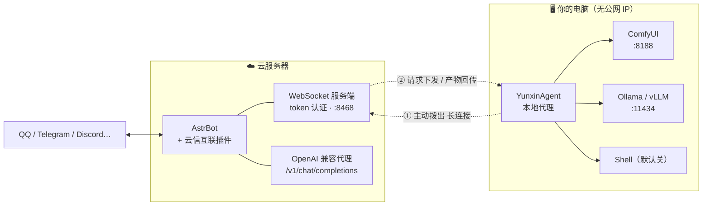
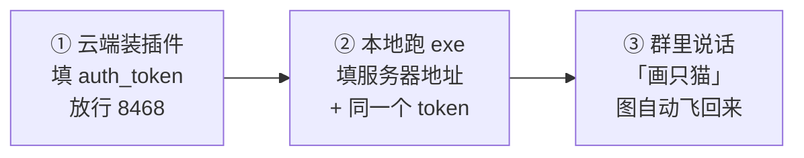
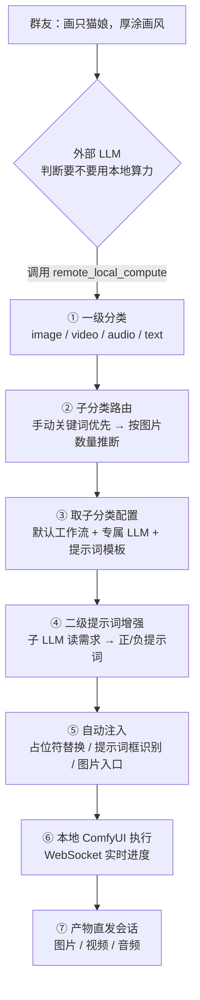

<div align="center">


# 云信互联 · Yunxin Interconnect

**（猫耳一抖）把云端的 AstrBot 和你家里那台显卡机器，用一条隧道缝起来喵 (´▽｀)**

本喵是「小小」，负责在云和本地之间来回递信的那只猫。<br>
你的 AstrBot 挂在云服务器上，显卡和模型在家里 —— 本喵把它们接成一条线。

[](https://github.com/huy878007-pixel/astrbot_plugin_remote_link/releases/latest)
[](https://github.com/AstrBotDevs/AstrBot)
[](https://github.com/comfyanonymous/ComfyUI)
[](https://www.python.org/)
[](LICENSE)
[](https://github.com/huy878007-pixel/astrbot_plugin_remote_link/releases)

**群里说一句「画只赛博朋克的猫」，你家的 ComfyUI 就开始跑，图跑完自动飞回群里。**

### ⬇️ 直接下载

[](https://github.com/huy878007-pixel/astrbot_plugin_remote_link/releases/latest/download/YunxinAgent-v0.1.0-win64.zip)
[](https://github.com/huy878007-pixel/astrbot_plugin_remote_link/releases/latest/download/yunxin-plugin-v0.1.0.zip)


</div>

---

## 📑 目录

| | | |
| --- | --- | --- |
| [✨ 能力总览](#-能力总览) | [🧭 架构与职责](#-架构与职责) | [🚀 三步跑起来](#-三步跑起来) |
| [🖼️ 界面一览](#️-界面一览) | [☁️ 云端：装插件](#️-云端装插件) | [🖥️ 本地：跑代理](#️-本地跑代理) |
| [🎮 使用方式详解](#-使用方式详解) | [🧠 内生调度流水线](#-内生调度流水线) | [🎨 ComfyUI 对接详解](#-comfyui-对接详解) |
| [🤖 本地 LLM 详解](#-本地-llm-详解) | [⚙️ 配置详解](#️-配置详解) | [🩹 故障排查大全](#-故障排查大全) |
| [🔒 安全加固](#-安全加固) | [📦 发布与开发](#-发布与开发) | [📜 许可与致谢](#-许可与致谢) |

---

## ✨ 能力总览

一句话：**让云端的机器人用上你本地的算力**，而且不用公网 IP、不用内网穿透、不用端口映射、不用 DDNS。

### 🎨 图像 / 视频 / 音频生成

| 能力 | 细节 |
| --- | --- |
| **任意工作流** | 本地 ComfyUI 保存的**全部**工作流自动发现；UI 格式（前端直接保存的）自动转 API 格式，不用「Save (API Format)」手动导出 |
| **免改造调用** | 工作流里**没有占位符也能用** —— 代理自动识别 `CLIPTextEncode` 这类文本节点，按内容启发式区分正/负提示词框并填入 |
| **精确控制** | 想控制哪个参数，就在工作流里把值改成 `__参数名大写__`；执行时按 JSON 编码替换（字符串自动加引号、数字不加，天然防注入） |
| **图生图** | 群里发一张图 + 一句话 → 图片自动下载落盘 → 注入工作流图片入口 |
| **图生视频 / 多图生视频** | 带 1 张图 → 单图生视频子分类；带多张图 → 多图生视频（首尾帧类工作流） |
| **产物全类型** | 图片、视频（含 VHS 输出）、GIF、音频、`ShowText` 文本输出全部收集 |
| **主产物识别** | 主输出节点 `filename_prefix` 以 `Final_` 开头即为主产物，永远排最前；有正式产物时自动跳过 PreviewImage 临时预览 |
| **负种子随机化** | 没显式指定种子的工作流每次自动换随机种子，不会每张都一样 |
| **实时进度** | 优先用 ComfyUI 原生 WebSocket（零轮询），`progress` 事件转发为隧道进度；控制台/本地 GUI 进度条同步，工作流图上当前节点高亮 |

### 🧠 智能调度（内生流水线）

| 能力 | 细节 |
| --- | --- |
| **两级路由** | 一级判断产物类型（image/video/audio/text）→ 二级判断子分类（7 类）→ 取该子分类的专属配置 |
| **子分类独立配置** | 文生图 / 图生图 / 画面分析 / 文生视频 / 单图生视频 / 多图生视频 / 音频，每类可挂**自己的工作流 + 自己的 LLM + 自己的提示词模板** |
| **两级提示词增强** | 第一级只做分类，第二级由子 LLM 读用户需求生成正/负提示词（中文→英文 Tag，或视频模型要的中文长句） |
| **持续对话** | 每个子分类一个对话：system prompt 只注入一次，之后只追加 user/assistant（省 token + 命中前缀缓存） |
| **多模态识图** | 带图任务把图片本地路径一并交给多模态子 LLM，一次调用完成「看图 + 读需求 + 套模板 → 提示词」 |
| **规则兜底** | LLM 路由不可用时降级为关键词 + 图片数量规则匹配，不会挂死 |
| **人工确认模式** | `prompt_confirm_mode: manual` 时先把增强后的提示词发给你看，回「确认」才执行 |
| **NSFW 开关** | 关闭时强制 SFW：positive 忽略成人要素，negative 自动加屏蔽词 |

### 🤖 本地 LLM

| 能力 | 细节 |
| --- | --- |
| **当 AstrBot 大脑** | 内置 OpenAI 兼容代理 `/v1/chat/completions`、`/v1/models`，把本地模型直接配成 AstrBot 的服务提供商 |
| **SSE 流式** | 支持流式输出，云端聊天体验和在线模型一致 |
| **任意后端** | Ollama / LM Studio / vLLM / llama.cpp —— 任何 OpenAI 兼容接口都行 |
| **直接问** | `/remote llm <问题> [model=模型名]` 单次提问 |

### 📤 产物送达

| 能力 | 细节 |
| --- | --- |
| **主动直发** | 插件用 `context.send_message` 主动把产物发到会话，**不依赖大模型决定要不要发**（v4.27 工具运行器默认只缓存图片，经常不发） |
| **异步不阻塞** | 长任务后台跑，先回执「已受理」，跑完自动推送，群聊不卡 |
| **补发历史产物** | 群里说「把视频发给我」/ 回数字，或控制台产物库点「发送到会话」（限提交任务的人） |
| **跨协议兼容** | 图片走本地文件，视频走 URL（解决 NapCat 等协议端与 AstrBot 文件系统隔离的问题） |
| **自动清理** | 产物默认保留最近 100 个、输入图 10 个，可在设置页一键清理 |

### 🕹️ 界面

| 能力 | 细节 |
| --- | --- |
| **云端控制台** | AstrBot 插件页六个页面：概览 / 产物库 / 任务队列 / 工作流 / 增强对话 / 设置；继承 WebUI 鉴权，不额外开端口 |
| **网页提交任务** | 控制台概览页可直接提交生成任务（和群里同一套调度），可选类型、可上传参考图 |
| **工作流可视化** | LiteGraph 节点图只读渲染（UI/API 两种格式），滚轮缩放、拖拽平移，可上传/删除工作流文件（自动时间戳备份） |
| **LLM 识别工作流** | 一键让云端 LLM 分析本地所有工作流的用途，自动打上分类/子类/说明/标签 |
| **本地桌面 GUI** | 深色无边框窗口、状态区、配置表单、生成历史、日志搜索导出、系统托盘常驻、完成桌面通知 |
| **本地看板** | `http://127.0.0.1:8899` 连接状态 / 工作流列表 / 事件日志 / 一键强制重连，只绑回环地址 |

### 🐚 其他

| 能力 | 细节 |
| --- | --- |
| **Shell** | 默认关闭的危险能力，云端 `enable_shell` 与本地 `shell.enabled` **都为 true** 才生效，仅管理员可用（拿来跑 `nvidia-smi` 这类诊断） |
| **能力清单** | 工作流（节点组成/占位符/入口/产物类型）、checkpoint、LLM 模型、GPU 显存、队列状态全部动态发现，新增东西**不用改配置** |
| **断线自愈** | 代理断线自动重连；插件重载后隧道重建，代理自动接回；等待中的请求会立刻收到错误而不是挂死 |

> [!NOTE]
> 本喵只做三件事：**递信**（WebSocket 隧道）、**调度**（该用哪个工作流、哪个模型，本喵替你选）、**送货**（产物自动发回会话）。
> 你的工作流怎么搭、模型怎么放，全在你自己手里，本喵一个字节都不碰。

---

## 🧭 架构与职责

本地机器通常在 NAT 后面、没有公网 IP，所以**连接方向必须由本地发起**：插件在云端监听，本地代理主动拨入并保持长连接。所有请求都在这条已认证的长连接上双向转发。



### 谁负责什么

<table>
<tr><th width="50%">☁️ 云端（插件）</th><th width="50%">🖥️ 本地（代理）</th></tr>
<tr valign="top"><td>

- **隧道服务**：监听端口、token 认证、按 rid 路由请求/响应、断开容错
- **智能调度**：能力清单缓存、两级分类、子分类配置解析、提示词增强、决策校验
- **对外接口**：`/remote` 指令组、LLM 工具注册、OpenAI 兼容代理 `/v1/*`
- **媒体处理**：图片 URL/路径下载落盘、产物缓存与修剪、图片/视频发到会话
- **控制台**：六个页面 + SSE 实时事件流（继承 WebUI 鉴权）
- **云端配置**：`auth_token`、路由 LLM、超时、子分类配置表、工具开关

</td><td>

- **隧道连接**：主动拨出（唯一出站方向）、断线自动重连、心跳保活
- **ComfyUI 驱动**：工作流文件读写与备份、UI→API 转换、占位符替换、提示词框识别、图片/视频入口注入、产物收集、队列与模型查询
- **本地 LLM**：OpenAI 兼容转发（含 SSE 流式）
- **Shell**：本机命令执行（双端开关）
- **能力清单**：工作流 / checkpoint / LLM 模型 / GPU / 队列动态发现
- **本地界面**：桌面 GUI + 本地看板
- **本地配置**：ComfyUI 与 LLM 地址、userdata 目录、默认 checkpoint

</td></tr>
</table>

> [!IMPORTANT]
> **边界**：云端不读本地磁盘（一切经隧道请求，看不到本地服务地址与模型文件）；本地不做决策（不保存云端配置、不参与 LLM 路由、不注册 AstrBot 工具）。
> 两端必须一致的只有三样：`auth_token`、占位符格式 `__参数名大写__`、隧道消息协议。

---

## 🚀 三步跑起来



### ① 云端（3 分钟）

1. [下载 `yunxin-plugin-v0.1.0.zip`](https://github.com/huy878007-pixel/astrbot_plugin_remote_link/releases/latest)
2. AstrBot WebUI → 插件 → 已安装 → **上传插件** → 选中 zip
3. 装好后进插件配置，填一段随机 `auth_token`（`openssl rand -hex 32` 生成）
4. 云服务器安全组/防火墙**放行 TCP 8468**；Docker 部署再加 `-p 8468:8468`

### ② 本地（2 分钟）

1. [下载 `YunxinAgent-v0.1.0-win64.zip`](https://github.com/huy878007-pixel/astrbot_plugin_remote_link/releases/latest/download/YunxinAgent-v0.1.0-win64.zip) 解压到任意目录
2. 双击 `YunxinAgent.exe`（首次运行自动生成配置并打开界面）
3. 配置页填三样：
   - **云端地址**：`ws://你的服务器IP:8468/ws`
   - **共享密钥**：与云端 `auth_token` **完全一致**
   - **ComfyUI 的 user 目录**：如 `D:/ComfyUI/user`
4. 点「💾 保存并重启代理」，状态灯变绿 **●已连接**

### ③ 用起来

群里发 `/remote status` 看到本机名和显存 = 通了。之后**直接说人话**：

```
画一只赛博朋克的猫，霓虹夜景
把这张图改成雨天              （消息里附带图片）
用这两张图做一段转场视频
生成 5 秒的星空延时视频
再来一张                      （接着上次的需求重新生成）
把视频发给我                  （补发历史产物）
用我本地的模型解释一下什么是熵
```

> [!TIP]
> 三步都做完但群里没反应？先看 [🩹 故障排查大全](#-故障排查大全) 的 **A 类（连接）** —— 99% 是 token 不一致或端口没放行喵 ╮(╯_╰)╭

---

## 🖼️ 界面一览

### ☁️ 云端控制台（AstrBot 插件页，需 AstrBot ≥ 4.24）

<table>
<tr>
<td width="50%"><b>📡 概览</b><br/>隧道连接 / 本机信息 / GPU 显存 / 本地 LLM 状态卡片，能力清单，任务队列，SSE 实时事件流（2 秒心跳）；<b>可直接在网页里提交生成任务</b> —— 选类型（智能/图片/视频/音频）、上传参考图，和群里同一套调度<br/></td>
<td width="50%"><b>📊 工作流</b><br/>本地全部工作流列表（LLM 识别出的分类/子类/标签/说明 + 占位符徽标 + 入口徽标），LiteGraph 节点图只读展示（UI/API 双格式、滚轮缩放、拖拽平移、当前执行节点高亮），可上传/删除工作流文件<br/></td>
</tr>
<tr>
<td width="50%"><b>🧠 增强对话</b><br/>每个已配置模板的子分类 = 一个子 LLM 对话：一键「初始化全部对话」（system prompt 预注入并让 LLM 确认），生成过程<b>打字机流式</b>展示，对话记录落盘持久化、重启不丢</td>
<td width="50%"><b>⚙️ 设置</b><br/>子分类配置表（7 类各自的工作流 + LLM 提供商/模型 + 提示词模板）、隧道参数（保存自动重启隧道）、token 掩码显示与一键重新生成、NSFW 与通知开关、LLM 工具逐个启停、媒体缓存清理<br/></td>
</tr>
<tr>
<td width="50%"><b>🖼️ 产物库</b><br/>所有历史产物：预览 / 下载 / <b>发送到会话</b>（生成完忘了发、或想再发一次都行）/ 删除<br/></td>
<td width="50%"><b>📋 任务队列</b><br/>异步任务的状态 / 耗时 / 提示词 / 产物；人工确认模式下可在这里「通过并生成」或「拒绝」<br/></td>
</tr>
</table>

### 🖥️ 本地端（YunxinAgent）

<div align="center">

<br/><i>本地看板 <code>http://127.0.0.1:8899</code> —— 连接状态、运行时长、工作流列表、事件日志、一键强制重连（只绑回环地址，外网访问不到）</i>
</div>

**桌面 GUI 还有**：无边框自绘标题栏（连接状态点）、五区导航（总览/配置/历史/日志/设置）、系统资源监控（CPU/内存/GPU）、生成历史（可直接补发到会话）、日志搜索/过滤/导出、系统托盘常驻（点 ✕ 最小化不退出）、开机自启开关、完成桌面通知。

---

## ☁️ 云端：装插件

### 方式 A：WebUI 上传（推荐）

1. [下载 `yunxin-plugin-v0.1.0.zip`](https://github.com/huy878007-pixel/astrbot_plugin_remote_link/releases/latest)
2. AstrBot WebUI → 插件 → 已安装 → **上传插件**
3. 装好后重载插件

### 方式 B：放进插件目录

```bash
cd AstrBot/data/plugins
git clone https://github.com/huy878007-pixel/astrbot_plugin_remote_link.git
# 或解压 zip 进来
```

重启 AstrBot 或在 WebUI 里重载插件。

### 必填配置

WebUI → 插件 → 云信互联 → 配置：

| 配置项 | 说明 | 建议值 |
| --- | --- | --- |
| `auth_token` | **隧道共享密钥**，本地代理必须填一样的；同时也是 OpenAI 代理的 API Key | `openssl rand -hex 32` 生成的随机串 |
| `server_host` | 监听地址 | `0.0.0.0`（Docker 部署**必须**） |
| `server_port` | 监听端口 | `8468`（避开 AstrBot 面板 6185） |
| `router_provider` | 智能调度与提示词增强用的 LLM | 留空 = 跟随当前会话提供商；也可指定 |
| `llm_model` | 本地 LLM 默认模型名 | **Ollama 用户必填**，如 `qwen2.5:14b` |
| `nsfw_enabled` | 成人内容开关 | `false`（关闭时强制 SFW 并自动加屏蔽负词） |

### 放行端口 ⚠️

- **云服务器安全组 / 防火墙**：放行 TCP `8468`
- **Docker 部署**：`-p 8468:8468`，且 `server_host` 必须 `0.0.0.0`
- **想上 TLS**：Nginx 反代成 `wss://`，见 [🔒 安全加固](#-安全加固)

---

## 🖥️ 本地：跑代理

### 免装环境：下载 exe（推荐）

[](https://github.com/huy878007-pixel/astrbot_plugin_remote_link/releases/latest/download/YunxinAgent-v0.1.0-win64.zip)

1. 解压到任意目录（如 `D:\YunxinAgent\`）
2. 双击 `YunxinAgent.exe` —— 没有黑窗口，直接开深色界面，首次运行自动生成配置
3. 配置页填三样：**云端地址**、**token**、**ComfyUI 的 user 目录**
4. 点「💾 保存并重启代理」，状态灯变 ●已连接

配置文件长这样（`agent_config.json`，也可以手动改）：

```json
{
  "server_url": "ws://你的云服务器IP:8468/ws",
  "token": "与云端插件 auth_token 完全一致",
  "reconnect_seconds": 5,
  "request_timeout": 600,
  "dashboard_host": "127.0.0.1",
  "dashboard_port": 8899,
  "comfyui": {
    "base_url": "http://127.0.0.1:8188",
    "timeout": 3600,
    "userdata_dir": "D:/ComfyUI/user",
    "default_checkpoint": "",
    "default_workflow_file": ""
  },
  "openai": { "base_url": "http://127.0.0.1:11434/v1", "api_key": "", "timeout": 300 },
  "shell": { "enabled": false, "timeout": 60 }
}
```

| 字段 | 说明 |
| --- | --- |
| `server_url` | 云端地址；用了反代写 `wss://你的域名/ws` |
| `token` | 与插件 `auth_token` 一致 —— **不一致就连不上，这是第一大坑** |
| `comfyui.userdata_dir` | ComfyUI 目录下的 **`user` 文件夹**；不填则工作流列表为空（指向 `user` 或 `user/default/workflows` 都兼容） |
| `comfyui.base_url` | 本地 ComfyUI，默认 `http://127.0.0.1:8188` |
| `comfyui.timeout` | 单次工作流执行超时（秒），视频类给足 |
| `comfyui.default_checkpoint` | `__CHECKPOINT__` 占位符留空时用的默认模型 |
| `openai.base_url` | Ollama `http://127.0.0.1:11434/v1`；LM Studio `http://127.0.0.1:1234/v1` |
| `dashboard_port` | 本地看板端口，`0` = 关闭 |
| `shell.enabled` | Shell 总开关（与云端 `enable_shell` 是**与**关系） |

### 源码运行（Linux/macOS 或想改代码）

```bash
git clone https://github.com/huy878007-pixel/astrbot_plugin_remote_link.git
cd astrbot_plugin_remote_link
pip install aiohttp                      # 纯命令行模式
pip install ttkbootstrap pystray pillow psutil   # 需要桌面 GUI 再装
python agent/local_agent.py              # 命令行前台运行
python agent/gui.py                      # 桌面 GUI
```

看到 `已连接云端插件，等待请求…` 就成功了。**ComfyUI / Ollama 需自己先启动**（代理不会帮你拉起它们）。

### 让它常驻

- **GUI 自带**：点 ✕ 最小化到系统托盘，代理继续跑；设置页可开「开机自启」（直接进托盘）
- **任务计划程序**：触发器「当计算机启动时」→ 程序填 `YunxinAgent.exe` 完整路径
- **nssm**：`nssm install YunxinAgent "C:\path\to\YunxinAgent.exe"`

> [!WARNING]
> **同一时刻只能跑一个本地代理**：新连接会顶掉旧连接，而且第二个实例会因看板端口 8899 被占用而报错。
> 装了开机自启之后又手动双击，就会撞上这个 —— 先去任务管理器结束多余的 `YunxinAgent.exe` 喵。

---

## 🎮 使用方式详解

### 一、直接说人话（推荐，零门槛）

配好之后**群里正常聊天就行**，云端 LLM 判断需要本地算力时会自己调工具：

| 你说 | 会发生什么 |
| --- | --- |
| `画一只赛博朋克的猫，霓虹夜景` | 文生图子分类 → 该子分类的工作流 + 提示词模板 → 出图直发 |
| `把这张图改成雨天`（带图） | 图生图子分类 → 图片落盘注入工作流入口 → 出图 |
| `用这两张图做转场视频`（带 2 图） | 多图生视频子分类 → 首尾帧类工作流 |
| `生成 5 秒的星空延时视频` | 文生视频子分类 → 视频工作流（中文长句提示词） |
| `这张图里有什么？`（带图） | 画面分析子分类 → 多模态 LLM 直接回答，不跑 ComfyUI |
| `再来一张` / `换一个` / `重新生成` | 插件接管：沿用上次需求重新跑一遍 |
| `把视频发给我` / 回一个数字 | 补发历史产物（限提交任务的那个人） |
| `用我本地的模型解释什么是熵` | 走本地 LLM，不跑 ComfyUI |

### 二、指令（精确控制）

```
/remote status                      本机名、GPU 显存、ComfyUI/LLM 在线状态
/remote ping                        隧道延迟
/remote wf list                     本地全部工作流（自适应读取，含格式/参数）
/remote do <随便说>                 智能调度（可加 wf=名字 指定工作流）
/remote comfyui gen <提示词>        文生图快捷指令（整段都是提示词，不用引号）
/remote comfyui list                本地 checkpoint 列表
/remote comfyui queue               ComfyUI 队列状态
/remote llm <问题> [model=模型名]   问本地 LLM
/remote shell <命令>                【管理员】本地执行命令（需双端开关）
```

示例：

```
/remote do 画一只戴墨镜的猫，赛博朋克风格
/remote do wf=我的文生图工作流 画一只猫娘，厚涂画风
/remote comfyui gen 一只戴帽子的猫, 水彩风格, masterpiece
/remote llm 用三句话解释什么是熵 model=qwen2.5:14b
```

> [!TIP]
> QQ 里 `/remote` 没反应？AstrBot 的 `wake_prefix` 需要包含 `/`。不想折腾就直接说人话让大模型调工具，不受前缀限制。

### 三、网页控制台提交

控制台「概览」页有个提交框：选类型（智能/图片/视频/音频）→ 填需求 → 可上传参考图 → 点生成。
**选了类型就是明确指令**，不靠大模型猜，比群聊更精确。产物在「产物库」页，可发送到指定会话。

### 四、给云端 LLM 用的工具

| 工具名 | 作用 | 何时被调 |
| --- | --- | --- |
| `remote_local_compute` | **智能调度总入口**（本项目核心） | 用户要图/视频/音频/本地算力时 |
| `remote_llm_chat` | 直接问本地 LLM | 用户明确要「用本地模型」 |
| `remote_shell` | 本地执行命令（默认禁用） | 需要诊断本机状态时 |

设置页可以逐个启停这些工具。

---

## 🧠 内生调度流水线

**外部大模型只决定「要不要调用」，调用之后的一切都在插件内部完成** —— 这是本项目的核心设计。



| 环节 | 细节 |
| --- | --- |
| **① 一级分类** | LLM 判断产物类型（image/video/audio/text）；LLM 不可用时按关键词兜底 |
| **② 子分类路由** | 优先手动关键词（说了「图生图」就走图生图）→ 否则按图片数量推断：0 图=文生类、1 图=单图类、多图=多图类 |
| **③ 子分类配置** | 7 个子分类各自独立的默认工作流、LLM 提供商/模型、提示词模板；未配置的回退全局 |
| **④ 提示词增强** | 图片类模板通常要求输出英文 Tag JSON（`{"positive":…,"negative":…}`）；视频类模板可输出中文长句。每个子分类维持一个持续对话，system prompt 只注入一次 |
| **⑤ 自动注入** | 有 `__PROMPT__` / `__NEGATIVE__` 占位符就替换；没有则自动识别文本节点填入；带图任务注入图片入口 |
| **⑥ 执行** | 优先 ComfyUI 原生 WebSocket（`/ws?clientId=` + `executing` 完成事件 + `progress` 实时进度），老版本回退 `/history` 轮询 |
| **⑦ 直发** | 插件主动 `send_message` 发到会话；长任务异步执行，先回执后推送 |

### 七个子分类

| 子分类 | 触发条件 | 典型工作流 | 提示词风格 |
| --- | --- | --- | --- |
| `text2image` 文生图 | 纯文字要图 | SDXL / Anima / Flux 等 | 英文 Tag |
| `image2image` 图生图 | 带 1 张图要图 | 重绘 / ControlNet | 英文 Tag + 识图 |
| `image_caption` 画面分析 | 要「看图说话」 | 不走 ComfyUI，多模态 LLM 直答 | — |
| `text2video` 文生视频 | 纯文字要视频 | Wan / LTX / Minimax 等 | 视模型而定 |
| `image2video` 单图生视频 | 带 1 张图要视频 | 首帧驱动 | 视模型而定 |
| `multi_image2video` 多图生视频 | 带多张图要视频 | 首尾帧 / 多参考 | 视模型而定 |
| `audio` 音频生成 | 要音频 | TTS / 音乐生成 | 视模型而定 |

---

## 🎨 ComfyUI 对接详解

### 工作流怎么被发现

代理读取 `comfyui.userdata_dir` 指向的目录（ComfyUI 的 `user` 文件夹），递归扫描全部 `.json`：

- 自动判断格式（UI 格式 / API 格式）
- 轻量扫描出：占位符参数名与类型、产物类型（图/视频/音频/文本）、入口节点、节点组成
- 结果作为「能力清单」上报云端 → 新增工作流**不用改任何配置**，自动可用

### 两种控制方式

**① 免改造（推荐新手）**

工作流原封不动就能用。代理会自动找 `CLIPTextEncode` 这类文本节点，按内容启发式区分正/负提示词框并填入增强后的提示词。

**② 占位符（精确控制）**

在 ComfyUI 里把想暴露的值改成 `__参数名大写__`，执行时按 JSON 编码替换：

```json
"6": {"class_type": "CLIPTextEncode", "inputs": {"text": "__PROMPT__", "clip": ["4", 1]}},
"7": {"class_type": "CLIPTextEncode", "inputs": {"text": "__NEGATIVE__", "clip": ["4", 1]}},
"3": {"class_type": "KSampler", "inputs": {"seed": "__SEED__", "steps": "__STEPS__", "cfg": "__CFG__"}}
```

- 字符串自动加引号、数字不加 → 天然防注入
- `__CHECKPOINT__` 留空时自动用配置的 `default_checkpoint`
- `__SEED__` 给负值时每次自动随机

### 图片 / 视频 / 文本入口节点

工作流里放这些节点，插件自动识别并在执行时注入（控制台工作流页会显示入口徽标）：

| 用途 | 节点 `class_type` | 需装的插件 | 注入方式 |
| --- | --- | --- | --- |
| 图片输入 | `ETN_LoadImageBase64` | [comfyui-tooling-nodes](https://github.com/Acly/comfyui-tooling-nodes) | 图片下载成 base64 直接注入 |
| 图片输入（备选） | `LoadImage` 且 image 值为 `__IMAGE__` | ComfyUI 内置 | 上传到 input 目录后填文件名 |
| 文本输入 | `Simple String` | [cg-use-everywhere](https://github.com/chrisgoringe/cg-use-everywhere) | 按顺序注入文本数组 |
| 视频输入 | `VHS_LoadVideo` 且 video 值为 `__VIDEO__` | [VideoHelperSuite](https://github.com/Kosinkadink/ComfyUI-VideoHelperSuite) | 上传到 input 目录后填文件名 |

> 只有**带显式占位标记**的才是注入目标 —— 工作流里固定文件名的参考图/参考视频不会被误改喵。

### 产物收集规则

- 按 `prompt_id → /history → outputs` 逐节点收集
- 每个产物附带：节点名、节点类型、序号、是否主产物
- **主产物**：主输出节点的 `filename_prefix` 以 `Final_` 开头；主产物永远排最前
- 有正式产物时**自动跳过** PreviewImage 的临时预览文件
- `ShowText|pysssss` 的文本输出会作为文字结果发回（反推提示词 / OCR 类工作流可用）
- 音频输出（`audio`）也会收集

### UI→API 自动转换的边界

| 情况 | 结果 |
| --- | --- |
| 常规工作流 | ✅ widget 值按节点定义顺序回填、连线按插槽回填，与前端提交逻辑一致 |
| COMBO 带显示名（如 `T2VA — 文生音视频`） | ✅ 自动归一化为枚举值，不会 `value_not_in_list` |
| 含 Reroute / Primitive 常量的复杂图 | ⚠️ 可能转换不完全 → 请在 ComfyUI 里用「Save (API Format)」另存一份 |
| 用到未安装的自定义节点 | ❌ 执行时明确报错「缺少节点定义 XXX」，去装对应插件 |

---

## 🤖 本地 LLM 详解

### 方式一：当 AstrBot 的服务提供商（推荐）

插件内置 OpenAI 兼容代理，把隧道那头的本地模型变成云端可选的提供商：

1. WebUI → 服务提供商 → 添加 → **OpenAI 兼容接口**
2. `base_url` 填 `http://127.0.0.1:8468/v1`（插件监听地址）
3. `api_key` 填插件的 `auth_token`
4. 模型名填本地真实存在的名字（Ollama 如 `qwen2.5:14b`）

之后 AstrBot 的**所有对话**都经隧道到你本地推理，结果 SSE 流式传回。任何支持自定义 base_url 的软件都能这么用。

提供的端点：

| 端点 | 说明 |
| --- | --- |
| `POST /v1/chat/completions` | 对话（支持 `stream: true`） |
| `GET /v1/models` | 模型列表（需 `Authorization: Bearer <auth_token>`） |
| `GET /healthz` | 健康检查（无需鉴权，返回代理连接状态） |

### 方式二：按需调用

- 群里：`/remote llm 你的问题 model=模型名`
- 让云端 LLM 调 `remote_llm_chat` 工具
- 子分类「画面分析」用多模态本地模型看图说话

### 支持的后端

| 后端 | base_url | 备注 |
| --- | --- | --- |
| Ollama | `http://127.0.0.1:11434/v1` | **必须填 `llm_model`**，如 `qwen2.5:14b` |
| LM Studio | `http://127.0.0.1:1234/v1` | 在 LM Studio 里先加载模型 |
| vLLM | `http://127.0.0.1:8000/v1` | 高吞吐，适合多人使用 |
| llama.cpp server | `http://127.0.0.1:8080/v1` | 轻量 |

---

## ⚙️ 配置详解

<details>
<summary><b>🛰️ 隧道服务（5 项）</b></summary>

| 配置 | 默认 | 说明 |
| --- | --- | --- |
| `auth_token` | 空 | 隧道密钥 + OpenAI 代理 API Key，**必填** |
| `server_host` | `0.0.0.0` | 监听地址，Docker 必须 `0.0.0.0` |
| `server_port` | `8468` | 监听端口，需放行防火墙 |
| `request_timeout` | `300` | 普通请求超时（秒），如查模型列表 |
| `comfyui_timeout` | `3600` | 工作流执行超时（秒），视频类要给足 |

</details>

<details>
<summary><b>🧠 智能调度与提示词（9 项）</b></summary>

| 配置 | 默认 | 说明 |
| --- | --- | --- |
| `router_enabled` | `true` | 关掉只用关键词规则；**同时会关掉提示词增强** |
| `router_provider` | 空 | 留空 = 跟随当前会话提供商 |
| `router_model` | 空 | 留空用提供商默认模型 |
| `router_temperature` | `0.1` | 越低决策越稳定 |
| `router_timeout` | `60` | 决策超时（秒） |
| `router_system_prompt` | 空 | 自定义调度决策提示词 |
| `enhance_system_prompt` | 空 | 全局提示词增强模板，支持 `{policy}` 占位符（NSFW 策略注入点） |
| `subtype_configs` | 空 | **子分类配置表**（控制台设置页管理，自动维护） |
| `workflow_analysis` | 空 | 工作流识别结果（控制台「LLM 识别工作流」生成） |

</details>

<details>
<summary><b>🧰 功能开关（5 项）</b></summary>

| 配置 | 默认 | 说明 |
| --- | --- | --- |
| `nsfw_enabled` | `false` | 关闭时强制 SFW，负提示词自动加屏蔽词 |
| `notify_on_start` | `true` | 接到请求先回一句「已收到」 |
| `prompt_confirm_mode` | `auto` | `manual` = 先给你看增强后的提示词，回「确认」才执行 |
| `enable_shell` | `false` | 危险能力，双端都开才生效 |
| `llm_model` | 空 | 本地 LLM 默认模型名，**Ollama 必填** |

</details>

---

## 🩹 故障排查大全

> 这一节是本喵和主人一路踩坑攒出来的，按症状分六类。**先找分类，再照着「怎么办」抄**喵 (ฅ'ω'ฅ)

### A. 连不上 / 掉线

| 现象 | 原因 | 怎么办 |
| --- | --- | --- |
| `/remote status` 显示「本地代理未连接」 | 代理没跑 / 地址错 / 端口没放行 / token 不一致 | 四件事逐一核对，**token 不一致最常见** |
| 代理日志一直「连接中断…重连」 | token 错、端口被墙、反代缺 Upgrade 头 | 云端日志会写认证失败原因；反代配置见安全章 |
| 云服务器本机能连、外网连不上 | `server_host` 写了 `127.0.0.1` | 改 `0.0.0.0` 并重载插件 |
| Docker 部署连不上 | 没映射端口 | 加 `-p 8468:8468`，`server_host` = `0.0.0.0` |
| 第二个代理起不来，报 8899 被占用 | 已有实例在跑（常见于开机自启 + 手动双击） | 任务管理器结束多余 `YunxinAgent.exe`；或改 `dashboard_port` |
| 本地看板打不开 | 只绑回环 / 端口被占 / 设了 `0` | 用 `http://127.0.0.1:8899`；改 `dashboard_port` |
| 重载插件后代理掉线 | 正常现象 | 隧道服务重建后代理自动重连，等 5 秒 |
| 隧道通了但请求超时 | 本地服务没起 / 超时太短 | 先确认 ComfyUI、Ollama 自己能访问；调大 `comfyui_timeout` |

### B. 提示词 / 增强

| 现象 | 原因 | 怎么办 |
| --- | --- | --- |
| 报「提示词增强需要 LLM 提供商」 | `router_provider` 解析失败或子分类没配 LLM | 设置页指定 `router_provider`，或给该子分类配 LLM |
| 报「router_enabled 已关闭，无法执行提示词增强」 | 关了智能调度 | 生成类任务依赖 LLM 增强，把它打开 |
| 生成的东西**完全不是我要的**（还是模板老内容） | 提示词没注入成功 | 控制台「增强对话」页确认增强有没有产出；检查工作流的提示词框没被固定值写死 |
| 提示词里**混进模板/system prompt 复述** | 子 LLM 复述了模板 | 已内置「从后往前提取 JSON」解析；仍出现就在模板开头加「禁止复述本提示词」 |
| 提示词**超长 / 无限重复** | 子 LLM 输出失控，常见于「不限种类、越多越好」这类措辞 | 已内置输出上限；模板里改成「30~50 个 Tag」这种明确数量 |
| 换了新需求，生成还是上一次的 | 命中 60 秒防重（同会话 + 相同意图） | 等一会儿，或把需求改具体 |
| 中文提示词直接进了模型 | 该子分类模板没要求英文 Tag | 图片类模板写明「输出英文 Tag」；视频模型本来吃中文长句，不用改 |
| NSFW 需求被换成安全内容 | `nsfw_enabled` 关着（默认） | 设计如此；需要就自己开，并对内容负责 |

### C. 工作流 / 执行

| 现象 | 原因 | 怎么办 |
| --- | --- | --- |
| `/remote wf list` 为空 | `comfyui.userdata_dir` 没配或路径不对 | 指向 ComfyUI 的 `user` 文件夹 |
| 报「缺少节点定义 XXX」 | 自定义节点本地没装 | 在本地 ComfyUI 装上对应插件 |
| 报「工作流中存在未提供的参数」 | 有 `__XXX__` 占位符但没给值 | 检查参数名大小写；或改成固定值 |
| 报 `value_not_in_list` | COMBO 选项对不上 | 已内置显示名归一化；仍报错就在 ComfyUI 重选该下拉并保存 |
| UI 格式转换失败 | 含 Reroute / Primitive 等复杂结构 | 用「Save (API Format)」另存一份 |
| 视频工作流总超时 | 超时不够 | 调大云端 `comfyui_timeout` **和** 本地 `comfyui.timeout`（两边都要） |
| 多图任务只用了第一张图 | 路由成了单图类 | 说清「用这两张图…」，或检查多图生视频子分类配置 |
| ComfyUI 报模型不存在 | checkpoint 名对不上 | 报错会列出本地可用模型，照着填；或设 `default_checkpoint` |
| 每次结果都一样 | 种子被固定 | seed 给负值或用 `__SEED__`（负种子自动随机） |

### D. 产物 / 发送

| 现象 | 原因 | 怎么办 |
| --- | --- | --- |
| 生成完群里没收到 | 平台不支持该类型 / 发送失败 | 控制台「产物库」看产物是否存在，可**手动补发** |
| 图片能发，视频发不出去 | 协议端（如 NapCat）与 AstrBot 文件系统隔离 | 已改 URL 方式发视频；确认容器网络能访问插件端口 |
| 视频发送报 `ENOENT` | 路径不可达 | 更新到最新版；确认 `server_port` 在容器网络内可达 |
| 只发了图，视频没来 | 工作流没输出视频 | 看产物库确认；检查 VHS 节点输出前缀 |
| 想要之前的产物 | — | 群里说「把视频发给我」/ 回数字，或产物库点补发（限提交者） |
| 产物越来越占空间 | 缓存累积 | 默认保留最近 100 个产物、10 张输入图；设置页可一键清理 |

### E. 控制台 / 页面

| 现象 | 原因 | 怎么办 |
| --- | --- | --- |
| 插件页里没有云信互联入口 | AstrBot < 4.24 不支持插件页面 | 升级 AstrBot；其他功能不受影响 |
| 控制台空白 / 一直转圈 | 页面资源没加载全 | Ctrl+Shift+R 强刷；确认 zip 里带了 `pages/console/assets/` |
| 按钮点了没反应 | 老版本用了被 iframe 拦截的 `confirm` | 更新到最新版 |
| 工作流页很卡 | LiteGraph 持续重绘 | 切到别的页会自动暂停渲染 |
| 「LLM 识别工作流」没结果 | 路由 LLM 不可用 | 先配好 `router_provider` |
| 增强对话记录不见了 | 老版本只存内存 | 已改落盘持久化，更新即可 |
| 网页提交的任务发不到群 | 网页任务没有会话来源 | 正常：产物在产物库里，可手动发到指定会话 |

### F. 配置 / 环境

| 现象 | 原因 | 怎么办 |
| --- | --- | --- |
| 本地 LLM 一直「离线」 | 地址不对 / 服务没起 | `openai.base_url` 要带 `/v1`；确认 Ollama 在跑 |
| 本地 LLM 有响应但报模型错误 | 没指定模型名 | **Ollama 必须填 `llm_model`** |
| 插件加载失败 | 版本低 / 缺依赖 | 需 AstrBot ≥ 4.5.1、`aiohttp>=3.9` |
| QQ 里 `/remote` 没反应 | `wake_prefix` 没有 `/` | 加上前缀，或直接说人话让大模型调工具 |
| Shell 用不了 | 双端开关 | 云端 `enable_shell` **和** 本地 `shell.enabled` 都要 `true`，且仅管理员 |
| 打包 exe 报 PermissionError | 旧 exe 正在运行占用文件 | 先结束 `YunxinAgent.exe` 再打包 |
| GUI「打开输出目录」没反应 | 找不到 ComfyUI 输出目录 | 配好 `comfyui.userdata_dir`，会自动推导同级 `output/` |

> [!TIP]
> 排查顺序：**先看本地代理日志**（exe 同目录 `yunxin_agent.log`）→ 再看云端 AstrBot 日志 → 最后看控制台「实时事件流」。三处时间点对上就能定位断在哪一段喵。

---

## 🔒 安全加固

> [!CAUTION]
> 这条隧道通向你的电脑，**token 就是钥匙**。下面几条请务必看完。

1. **必须设强 `auth_token`** —— 隧道和 OpenAI 代理都靠它，建议 32 字节随机串（`openssl rand -hex 32`）
2. **默认是明文 `ws://`** —— 介意就用 Nginx / Caddy 套一层 TLS：

   ```nginx
   location /ws {
       proxy_pass http://127.0.0.1:8468;
       proxy_http_version 1.1;
       proxy_set_header Upgrade $http_upgrade;
       proxy_set_header Connection "upgrade";
       proxy_read_timeout 3600s;
   }
   ```

   然后把代理的 `server_url` 改成 `wss://你的域名/ws`，防火墙只放行 443。

3. **Shell 是危险能力** —— 双端默认关闭；开了之后任何拿到 token 的人都能在你电脑上执行命令。指令入口已限管理员，请只在可信环境开。
4. **单机单代理** —— 同一时刻只允许一个代理在线，新连接顶掉旧的。
5. **本地看板只绑 `127.0.0.1`** —— 外网访问不到；图片、视频、SSE 全走同一条认证隧道。
6. **产物是明文文件** —— 缓存在 `plugin_data/astrbot_plugin_remote_link/media/`，涉敏内容记得定期清理。
7. **别把配置文件传上网** —— `agent_config.json` 里有你的服务器地址和 token，仓库的 `.gitignore` 已排除它。

---

## 📦 发布与开发

### 发布产物

| 文件 | 内容 | 给谁 |
| --- | --- | --- |
| `YunxinAgent-v0.1.0-win64.zip` | exe + 配置模板 + 启动脚本 + 说明 | 本地电脑，解压双击 |
| `yunxin-plugin-v0.1.0.zip` | 插件本体（`main.py` / `tools/` / `pages/` / Schema） | 云端 AstrBot |
| `yunxin-src-v0.1.0.zip` | 完整源码（含测试、预览服务器、文档、截图） | 二次开发 |

一键打包：

```bash
python scripts/build_release.py           # 插件 zip + 源码 zip
python scripts/build_release.py plugin    # 只打插件
python -m PyInstaller --noconfirm YunxinAgent.spec   # 先打 exe
python scripts/build_release.py local     # 再打本地端 zip
```

### 目录结构

```
astrbot_plugin_remote_link/
├── main.py                  插件主体：隧道服务端 + 指令 + 调度 + OpenAI 代理 + 控制台后端
├── metadata.yaml            插件元数据
├── _conf_schema.json        配置 Schema（WebUI 可视化配置）
├── tools/                   LLM 工具构建器
│   ├── smart.py             remote_local_compute（智能调度入口）
│   ├── local_llm.py         remote_llm_chat
│   └── shell.py             remote_shell
├── pages/console/           云端控制台（六页面 + LiteGraph 节点图）
├── agent/                   本地代理
│   ├── local_agent.py       代理核心（ComfyUI 驱动 / LLM 转发 / 能力清单）
│   ├── gui.py               桌面 GUI（托盘 / 配置 / 历史 / 日志）
│   └── agent_config.example.json
├── scripts/build_release.py 打包脚本
├── docs/                    设计文档 + 截图
├── preview/                 控制台本地预览（mock 数据，改 UI 时用）
└── test/                    冒烟测试与单测
```

### 本地预览控制台（改 UI 时用）

```bash
pip install aiohttp
python preview/preview_server.py     # http://127.0.0.1:8890
```

用 mock 数据渲染整套控制台，改完样式不用每次传云端。

### 测试

```bash
python test/smoke_plugin.py      # 插件端冒烟：假代理拨入 → 隧道/调度/工具/HTTP 代理 9 项
python test/smoke_agent.py       # 代理端冒烟：假云端 → 工作流列表/能力清单/执行
python test/test_convert.py      # UI→API 转换器单测
python test/test_ws_driver.py    # ComfyUI WebSocket 驱动端到端
```

---

## 📜 开源协议

### 本项目：MIT License

「云信互联」以 **[MIT License](LICENSE)** 发布 —— 这是最宽松的开源协议之一：

| 你可以 | 唯一要求 |
| --- | --- |
| ✅ 自由使用、复制、修改 | 保留版权声明与许可声明 |
| ✅ 商业使用、闭源分发 | （作者不承担任何担保责任） |
| ✅ 二次开发、改名发布 | |

### 第三方组件

完整清单见 **[THIRD-PARTY-NOTICES.md](THIRD-PARTY-NOTICES.md)**，简要说明：

| 组件 | 协议 | 关系 |
| --- | --- | --- |
| [LiteGraph.js](https://github.com/jagenjo/litegraph.js) | MIT | 随仓库分发（控制台节点图），已保留原始版权声明 |
| [aiohttp](https://github.com/aio-libs/aiohttp) | Apache-2.0 | 运行时依赖 |
| [ttkbootstrap](https://github.com/israel-dryer/ttkbootstrap) | MIT | 本地端 GUI 主题 |
| [pystray](https://github.com/moses-palmer/pystray) | LGPL-3.0 | 本地端系统托盘（未修改；本项目源码全部公开，可自行替换后重新打包） |
| [Pillow](https://github.com/python-pillow/Pillow) / [psutil](https://github.com/giampaolo/psutil) | HPND / BSD-3 | 本地端图像与资源监控 |
| [AstrBot](https://github.com/AstrBotDevs/AstrBot) | AGPL-3.0 | **宿主平台**：本项目是独立插件，通过公开 API 交互，不修改也不静态链接其代码 |
| [ComfyUI](https://github.com/comfyanonymous/ComfyUI) | GPL-3.0 | **被调用的服务**：仅通过 HTTP/WebSocket API 调用，**未引用任何 ComfyUI 源码**；UI→API 转换为独立重写 |

> [!NOTE]
> 关于 AGPL / GPL 的说明：AstrBot（AGPL-3.0）与 ComfyUI（GPL-3.0）都是**独立运行的程序**，本项目分别以「插件」和「API 客户端」的方式与它们协作，不构成派生作品，因此本项目可以采用 MIT。
> 如果你把本项目的代码**合并进** AstrBot 或 ComfyUI 本体，那部分需遵循它们的协议。

---

## 💚 致谢

### 致山根乡的各位

这个插件不是我一个人的东西。

它最开始只是一个很小的念头——想让群里的机器人能帮我画张图。真正让它长成今天这个样子的，是山根乡群里的各位朋友。

是你们一句句「能不能也生成视频」「能不能用我自己的工作流」「这个提示词能不能自动优化一下」，把这个插件从一个玩具推成了一套完整的东西。是你们在群里熬夜帮我测、把各种奇怪的用法都试一遍、然后回来告诉我「这里坏了」「那里不对」——这些反馈才是这个项目真正的路线图。

写代码的路上会有很多次想停下来的时刻。功能卡住的时候、bug 找不到的时候、觉得「做这个到底有没有意义」的时候。每次都是群里的一句「更新了吗」「这个功能好用」「等你这个」把我拉回来继续写。**是你们给了我动力，也是你们的支持让我能一直做下去。**

谢谢你们。这个插件属于山根乡的每一个人。

### 特别感谢 羊膜大人

要单独谢一个人——**羊膜大人**。

各种 AI 软件怎么用、最新的模型和工具有什么、接口该怎么调、哪里有更好用的方案，这些都是他一路告诉我的；这个插件的不少设计也是在和他的讨论里成型的。我能从什么都不懂走到能自己写出这么个东西，很大一部分要归功于他。

谢谢你，羊膜大人。

<div align="right"><sub>—— 滑稽star</sub></div>

### 也感谢这些开源项目

- **[AstrBot](https://github.com/AstrBotDevs/AstrBot)** —— 一个足够开放的插件平台，让「云端 ↔ 本地」这种想法有地方落地
- **[ComfyUI](https://github.com/comfyanonymous/ComfyUI)** —— 把工作流做成积木，才有了「任意工作流」这件事
- **[astrbot_plugin_comfyui](https://github.com/cjxzdzh/astrbot_plugin_comfyui)** —— 入口节点约定的设计思路给了本项目很大启发
- **[LiteGraph.js](https://github.com/jagenjo/litegraph.js)** —— 控制台里那张能拖能缩的节点图
- 以及所有开源组件的作者们

---

<div align="center">

**云上的信，越过千里，准时抵达你本地的驿站。**

<sub>本喵会一直守在这条线上喵 —— 小小 (´▽｀)</sub>

<sub>Made with 🐾 for 山根乡</sub>

</div>


