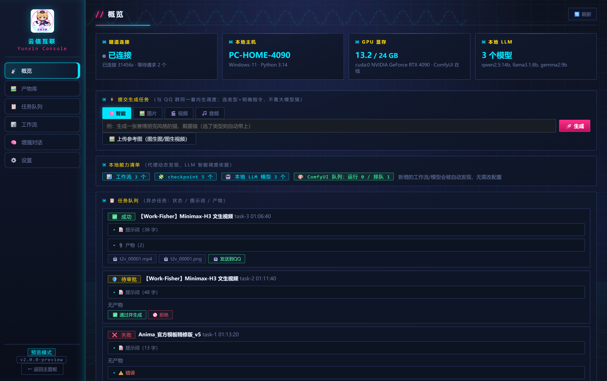
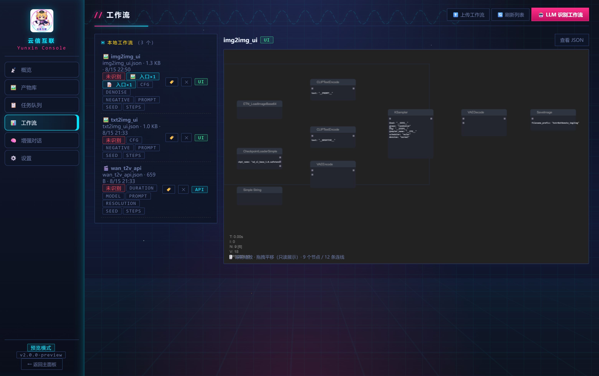
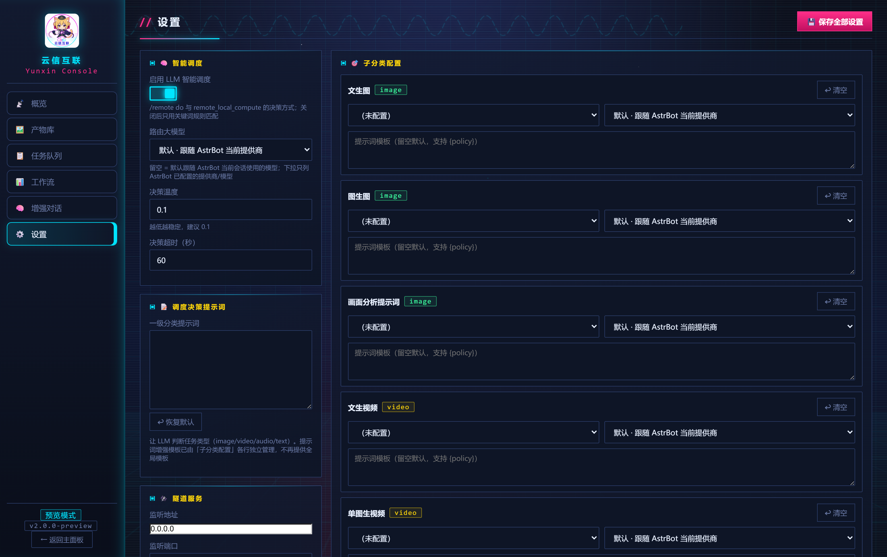
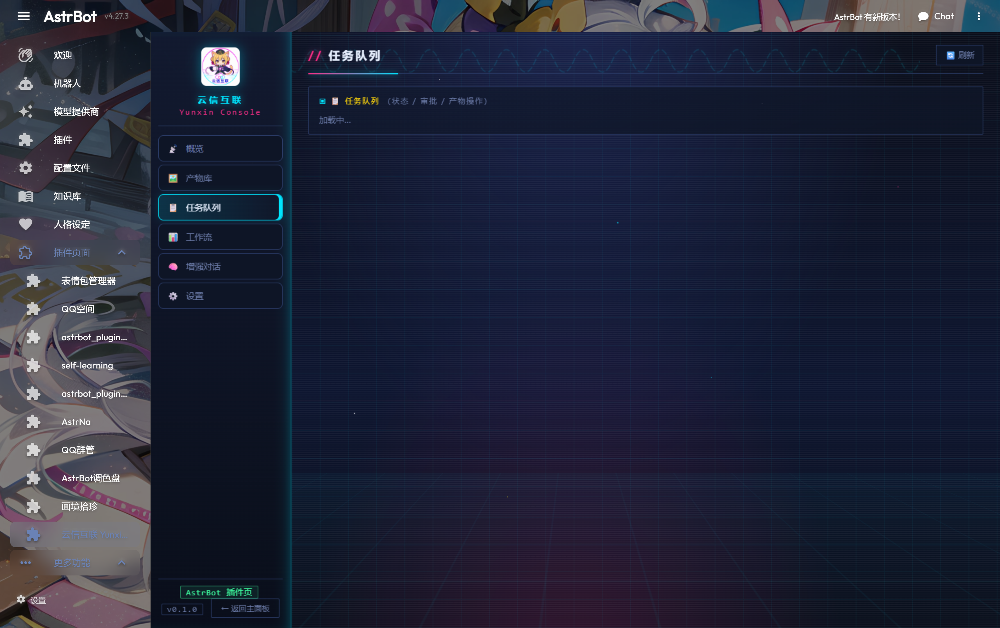
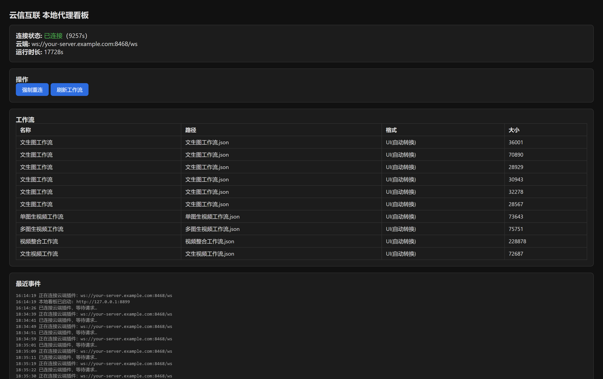
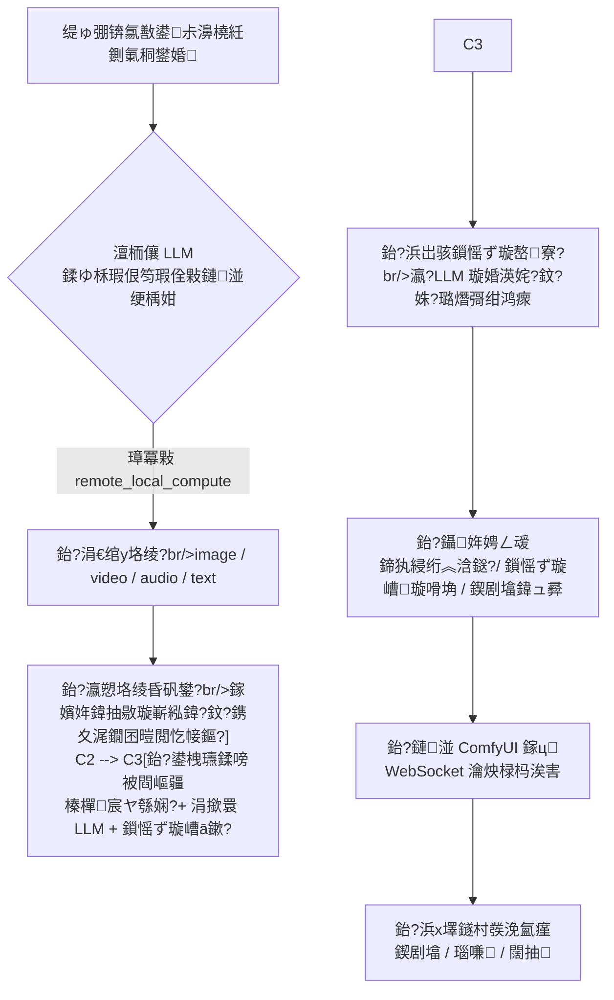

<div align="center">


# 浜戜俊浜掕仈 路 Yunxin Interconnect

**锛堢尗鑰充竴鎶栵級鎶婁簯绔殑 AstrBot 鍜屼綘瀹堕噷閭ｅ彴鏄惧崱鏈哄櫒锛岀敤涓€鏉￠毀閬撶紳璧锋潵鍠?(麓鈻斤絸)**

鏈柕鏄€屽皬灏忋€嶏紝璐熻矗鍦ㄤ簯鍜屾湰鍦颁箣闂存潵鍥為€掍俊鐨勯偅鍙尗銆?br>
浣犵殑 AstrBot 鎸傚湪浜戞湇鍔″櫒涓婏紝鏄惧崱鍜屾ā鍨嬪湪瀹堕噷 鈥斺€?鏈柕鎶婂畠浠帴鎴愪竴鏉＄嚎銆?
[](https://github.com/huy878007-pixel/astrbot_plugin_remote_link/releases/latest)
[](https://github.com/AstrBotDevs/AstrBot)
[](https://github.com/comfyanonymous/ComfyUI)
[](https://www.python.org/)
[](LICENSE)
[](https://github.com/huy878007-pixel/astrbot_plugin_remote_link/releases)

**缇ら噷璇翠竴鍙ャ€岀敾鍙禌鍗氭湅鍏嬬殑鐚€嶏紝浣犲鐨?ComfyUI 灏卞紑濮嬭窇锛屽浘璺戝畬鑷姩椋炲洖缇ら噷銆?*

### 猬囷笍 鐩存帴涓嬭浇

[
[](https://github.com/huy878007-pixel/astrbot_plugin_remote_link/releases/latest/download/yunxin-plugin-v0.1.1.zip)



</div>

---

## 馃搼 鐩綍

| | | |
| --- | --- | --- |
| [鉁?鑳藉姏鎬昏](#-鑳藉姏鎬昏) | [馃Л 鏋舵瀯涓庤亴璐(#-鏋舵瀯涓庤亴璐? | [馃殌 涓夋璺戣捣鏉(#-涓夋璺戣捣鏉? |
| [馃柤锔?鐣岄潰涓€瑙圿(#锔?鐣岄潰涓€瑙? | [鈽侊笍 浜戠锛氳鎻掍欢](#锔?浜戠瑁呮彃浠? | [馃枼锔?鏈湴锛氳窇浠ｇ悊](#锔?鏈湴璺戜唬鐞? |
| [馃幃 浣跨敤鏂瑰紡璇﹁В](#-浣跨敤鏂瑰紡璇﹁В) | [馃 鍐呯敓璋冨害娴佹按绾縘(#-鍐呯敓璋冨害娴佹按绾? | [馃帹 ComfyUI 瀵规帴璇﹁В](#-comfyui-瀵规帴璇﹁В) |
| [馃 鏈湴 LLM 璇﹁В](#-鏈湴-llm-璇﹁В) | [鈿欙笍 閰嶇疆璇﹁В](#锔?閰嶇疆璇﹁В) | [馃┕ 鏁呴殰鎺掓煡澶у叏](#-鏁呴殰鎺掓煡澶у叏) |
| [馃敀 瀹夊叏鍔犲浐](#-瀹夊叏鍔犲浐) | [馃摝 鍙戝竷涓庡紑鍙慮(#-鍙戝竷涓庡紑鍙? | [馃摐 璁稿彲涓庤嚧璋(#-璁稿彲涓庤嚧璋? |

---

## 鉁?鑳藉姏鎬昏

涓€鍙ヨ瘽锛?*璁╀簯绔殑鏈哄櫒浜虹敤涓婁綘鏈湴鐨勭畻鍔?*锛岃€屼笖涓嶇敤鍏綉 IP銆佷笉鐢ㄥ唴缃戠┛閫忋€佷笉鐢ㄧ鍙ｆ槧灏勩€佷笉鐢?DDNS銆?
### 馃帹 鍥惧儚 / 瑙嗛 / 闊抽鐢熸垚

| 鑳藉姏 | 缁嗚妭 |
| --- | --- |
| **浠绘剰宸ヤ綔娴?* | 鏈湴 ComfyUI 淇濆瓨鐨?*鍏ㄩ儴**宸ヤ綔娴佽嚜鍔ㄥ彂鐜帮紱UI 鏍煎紡锛堝墠绔洿鎺ヤ繚瀛樼殑锛夎嚜鍔ㄨ浆 API 鏍煎紡锛屼笉鐢ㄣ€孲ave (API Format)銆嶆墜鍔ㄥ鍑?|
| **鍏嶆敼閫犺皟鐢?* | 宸ヤ綔娴侀噷**娌℃湁鍗犱綅绗︿篃鑳界敤** 鈥斺€?浠ｇ悊鑷姩璇嗗埆 `CLIPTextEncode` 杩欑被鏂囨湰鑺傜偣锛屾寜鍐呭鍚彂寮忓尯鍒嗘/璐熸彁绀鸿瘝妗嗗苟濉叆 |
| **绮剧‘鎺у埗** | 鎯虫帶鍒跺摢涓弬鏁帮紝灏卞湪宸ヤ綔娴侀噷鎶婂€兼敼鎴?`__鍙傛暟鍚嶅ぇ鍐檁_`锛涙墽琛屾椂鎸?JSON 缂栫爜鏇挎崲锛堝瓧绗︿覆鑷姩鍔犲紩鍙枫€佹暟瀛椾笉鍔狅紝澶╃劧闃叉敞鍏ワ級 |
| **鍥剧敓鍥?* | 缇ら噷鍙戜竴寮犲浘 + 涓€鍙ヨ瘽 鈫?鍥剧墖鑷姩涓嬭浇钀界洏 鈫?娉ㄥ叆宸ヤ綔娴佸浘鐗囧叆鍙?|
| **鍥剧敓瑙嗛 / 澶氬浘鐢熻棰?* | 甯?1 寮犲浘 鈫?鍗曞浘鐢熻棰戝瓙鍒嗙被锛涘甫澶氬紶鍥?鈫?澶氬浘鐢熻棰戯紙棣栧熬甯х被宸ヤ綔娴侊級 |
| **浜х墿鍏ㄧ被鍨?* | 鍥剧墖銆佽棰戯紙鍚?VHS 杈撳嚭锛夈€丟IF銆侀煶棰戙€乣ShowText` 鏂囨湰杈撳嚭鍏ㄩ儴鏀堕泦 |
| **涓讳骇鐗╄瘑鍒?* | 涓昏緭鍑鸿妭鐐?`filename_prefix` 浠?`Final_` 寮€澶村嵆涓轰富浜х墿锛屾案杩滄帓鏈€鍓嶏紱鏈夋寮忎骇鐗╂椂鑷姩璺宠繃 PreviewImage 涓存椂棰勮 |
| **璐熺瀛愰殢鏈哄寲** | 娌℃樉寮忔寚瀹氱瀛愮殑宸ヤ綔娴佹瘡娆¤嚜鍔ㄦ崲闅忔満绉嶅瓙锛屼笉浼氭瘡寮犻兘涓€鏍?|
| **瀹炴椂杩涘害** | 浼樺厛鐢?ComfyUI 鍘熺敓 WebSocket锛堥浂杞锛夛紝`progress` 浜嬩欢杞彂涓洪毀閬撹繘搴︼紱鎺у埗鍙?鏈湴 GUI 杩涘害鏉″悓姝ワ紝宸ヤ綔娴佸浘涓婂綋鍓嶈妭鐐归珮浜?|

### 馃 鏅鸿兘璋冨害锛堝唴鐢熸祦姘寸嚎锛?
| 鑳藉姏 | 缁嗚妭 |
| --- | --- |
| **涓ょ骇璺敱** | 涓€绾у垽鏂骇鐗╃被鍨嬶紙image/video/audio/text锛夆啋 浜岀骇鍒ゆ柇瀛愬垎绫伙紙7 绫伙級鈫?鍙栬瀛愬垎绫荤殑涓撳睘閰嶇疆 |
| **瀛愬垎绫荤嫭绔嬮厤缃?* | 鏂囩敓鍥?/ 鍥剧敓鍥?/ 鐢婚潰鍒嗘瀽 / 鏂囩敓瑙嗛 / 鍗曞浘鐢熻棰?/ 澶氬浘鐢熻棰?/ 闊抽锛屾瘡绫诲彲鎸?*鑷繁鐨勫伐浣滄祦 + 鑷繁鐨?LLM + 鑷繁鐨勬彁绀鸿瘝妯℃澘** |
| **涓ょ骇鎻愮ず璇嶅寮?* | 绗竴绾у彧鍋氬垎绫伙紝绗簩绾х敱瀛?LLM 璇荤敤鎴烽渶姹傜敓鎴愭/璐熸彁绀鸿瘝锛堜腑鏂団啋鑻辨枃 Tag锛屾垨瑙嗛妯″瀷瑕佺殑涓枃闀垮彞锛?|
| **鎸佺画瀵硅瘽** | 姣忎釜瀛愬垎绫讳竴涓璇濓細system prompt 鍙敞鍏ヤ竴娆★紝涔嬪悗鍙拷鍔?user/assistant锛堢渷 token + 鍛戒腑鍓嶇紑缂撳瓨锛?|
| **澶氭ā鎬佽瘑鍥?* | 甯﹀浘浠诲姟鎶婂浘鐗囨湰鍦拌矾寰勪竴骞朵氦缁欏妯℃€佸瓙 LLM锛屼竴娆¤皟鐢ㄥ畬鎴愩€岀湅鍥?+ 璇婚渶姹?+ 濂楁ā鏉?鈫?鎻愮ず璇嶃€?|
| **瑙勫垯鍏滃簳** | LLM 璺敱涓嶅彲鐢ㄦ椂闄嶇骇涓哄叧閿瘝 + 鍥剧墖鏁伴噺瑙勫垯鍖归厤锛屼笉浼氭寕姝?|
| **浜哄伐纭妯″紡** | `prompt_confirm_mode: manual` 鏃跺厛鎶婂寮哄悗鐨勬彁绀鸿瘝鍙戠粰浣犵湅锛屽洖銆岀‘璁ゃ€嶆墠鎵ц |
| **NSFW 寮€鍏?* | 鍏抽棴鏃跺己鍒?SFW锛歱ositive 蹇界暐鎴愪汉瑕佺礌锛宯egative 鑷姩鍔犲睆钄借瘝 |

### 馃 鏈湴 LLM

| 鑳藉姏 | 缁嗚妭 |
| --- | --- |
| **褰?AstrBot 澶ц剳** | 鍐呯疆 OpenAI 鍏煎浠ｇ悊 `/v1/chat/completions`銆乣/v1/models`锛屾妸鏈湴妯″瀷鐩存帴閰嶆垚 AstrBot 鐨勬湇鍔℃彁渚涘晢 |
| **SSE 娴佸紡** | 鏀寔娴佸紡杈撳嚭锛屼簯绔亰澶╀綋楠屽拰鍦ㄧ嚎妯″瀷涓€鑷?|
| **浠绘剰鍚庣** | Ollama / LM Studio / vLLM / llama.cpp 鈥斺€?浠讳綍 OpenAI 鍏煎鎺ュ彛閮借 |
| **鐩存帴闂?* | `/remote llm <闂> [model=妯″瀷鍚峕` 鍗曟鎻愰棶 |

### 馃摛 浜х墿閫佽揪

| 鑳藉姏 | 缁嗚妭 |
| --- | --- |
| **涓诲姩鐩村彂** | 鎻掍欢鐢?`context.send_message` 涓诲姩鎶婁骇鐗╁彂鍒颁細璇濓紝**涓嶄緷璧栧ぇ妯″瀷鍐冲畾瑕佷笉瑕佸彂**锛坴4.27 宸ュ叿杩愯鍣ㄩ粯璁ゅ彧缂撳瓨鍥剧墖锛岀粡甯镐笉鍙戯級 |
| **寮傛涓嶉樆濉?* | 闀夸换鍔″悗鍙拌窇锛屽厛鍥炴墽銆屽凡鍙楃悊銆嶏紝璺戝畬鑷姩鎺ㄩ€侊紝缇よ亰涓嶅崱 |
| **琛ュ彂鍘嗗彶浜х墿** | 缇ら噷璇淬€屾妸瑙嗛鍙戠粰鎴戙€? 鍥炴暟瀛楋紝鎴栨帶鍒跺彴浜х墿搴撶偣銆屽彂閫佸埌浼氳瘽銆嶏紙闄愭彁浜や换鍔＄殑浜猴級 |
| **璺ㄥ崗璁吋瀹?* | 鍥剧墖璧版湰鍦版枃浠讹紝瑙嗛璧?URL锛堣В鍐?NapCat 绛夊崗璁涓?AstrBot 鏂囦欢绯荤粺闅旂鐨勯棶棰橈級 |
| **鑷姩娓呯悊** | 浜х墿榛樿淇濈暀鏈€杩?100 涓€佽緭鍏ュ浘 10 涓紝鍙湪璁剧疆椤典竴閿竻鐞?|

### 馃暪锔?鐣岄潰

| 鑳藉姏 | 缁嗚妭 |
| --- | --- |
| **浜戠鎺у埗鍙?* | AstrBot 鎻掍欢椤靛叚涓〉闈細姒傝 / 浜х墿搴?/ 浠诲姟闃熷垪 / 宸ヤ綔娴?/ 澧炲己瀵硅瘽 / 璁剧疆锛涚户鎵?WebUI 閴存潈锛屼笉棰濆寮€绔彛 |
| **缃戦〉鎻愪氦浠诲姟** | 鎺у埗鍙版瑙堥〉鍙洿鎺ユ彁浜ょ敓鎴愪换鍔★紙鍜岀兢閲屽悓涓€濂楄皟搴︼級锛屽彲閫夌被鍨嬨€佸彲涓婁紶鍙傝€冨浘 |
| **宸ヤ綔娴佸彲瑙嗗寲** | LiteGraph 鑺傜偣鍥惧彧璇绘覆鏌擄紙UI/API 涓ょ鏍煎紡锛夛紝婊氳疆缂╂斁銆佹嫋鎷藉钩绉伙紝鍙笂浼?鍒犻櫎宸ヤ綔娴佹枃浠讹紙鑷姩鏃堕棿鎴冲浠斤級 |
| **LLM 璇嗗埆宸ヤ綔娴?* | 涓€閿浜戠 LLM 鍒嗘瀽鏈湴鎵€鏈夊伐浣滄祦鐨勭敤閫旓紝鑷姩鎵撲笂鍒嗙被/瀛愮被/璇存槑/鏍囩 |
| **鏈湴妗岄潰 GUI** | 娣辫壊鏃犺竟妗嗙獥鍙ｃ€佺姸鎬佸尯銆侀厤缃〃鍗曘€佺敓鎴愬巻鍙层€佹棩蹇楁悳绱㈠鍑恒€佺郴缁熸墭鐩樺父椹汇€佸畬鎴愭闈㈤€氱煡 |
| **鏈湴鐪嬫澘** | `http://127.0.0.1:8899` 杩炴帴鐘舵€?/ 宸ヤ綔娴佸垪琛?/ 浜嬩欢鏃ュ織 / 涓€閿己鍒堕噸杩烇紝鍙粦鍥炵幆鍦板潃 |

### 馃悮 鍏朵粬

| 鑳藉姏 | 缁嗚妭 |
| --- | --- |
| **Shell** | 榛樿鍏抽棴鐨勫嵄闄╄兘鍔涳紝浜戠 `enable_shell` 涓庢湰鍦?`shell.enabled` **閮戒负 true** 鎵嶇敓鏁堬紝浠呯鐞嗗憳鍙敤锛堟嬁鏉ヨ窇 `nvidia-smi` 杩欑被璇婃柇锛?|
| **鑳藉姏娓呭崟** | 宸ヤ綔娴侊紙鑺傜偣缁勬垚/鍗犱綅绗?鍏ュ彛/浜х墿绫诲瀷锛夈€乧heckpoint銆丩LM 妯″瀷銆丟PU 鏄惧瓨銆侀槦鍒楃姸鎬佸叏閮ㄥ姩鎬佸彂鐜帮紝鏂板涓滆タ**涓嶇敤鏀归厤缃?* |
| **鏂嚎鑷剤** | 浠ｇ悊鏂嚎鑷姩閲嶈繛锛涙彃浠堕噸杞藉悗闅ч亾閲嶅缓锛屼唬鐞嗚嚜鍔ㄦ帴鍥烇紱绛夊緟涓殑璇锋眰浼氱珛鍒绘敹鍒伴敊璇€屼笉鏄寕姝?|

> [!NOTE]
> 鏈柕鍙仛涓変欢浜嬶細**閫掍俊**锛圵ebSocket 闅ч亾锛夈€?*璋冨害**锛堣鐢ㄥ摢涓伐浣滄祦銆佸摢涓ā鍨嬶紝鏈柕鏇夸綘閫夛級銆?*閫佽揣**锛堜骇鐗╄嚜鍔ㄥ彂鍥炰細璇濓級銆?> 浣犵殑宸ヤ綔娴佹€庝箞鎼€佹ā鍨嬫€庝箞鏀撅紝鍏ㄥ湪浣犺嚜宸辨墜閲岋紝鏈柕涓€涓瓧鑺傞兘涓嶇銆?
---

## 馃Л 鏋舵瀯涓庤亴璐?
鏈湴鏈哄櫒閫氬父鍦?NAT 鍚庨潰銆佹病鏈夊叕缃?IP锛屾墍浠?*杩炴帴鏂瑰悜蹇呴』鐢辨湰鍦板彂璧?*锛氭彃浠跺湪浜戠鐩戝惉锛屾湰鍦颁唬鐞嗕富鍔ㄦ嫧鍏ュ苟淇濇寔闀胯繛鎺ャ€傛墍鏈夎姹傞兘鍦ㄨ繖鏉″凡璁よ瘉鐨勯暱杩炴帴涓婂弻鍚戣浆鍙戙€?
```mermaid
flowchart LR
    subgraph CLOUD["鈽侊笍 浜戞湇鍔″櫒"]
        AB["AstrBot<br/>+ 浜戜俊浜掕仈鎻掍欢"]
        WS["WebSocket 鏈嶅姟绔?br/>token 璁よ瘉 路 :8468"]
        API["OpenAI 鍏煎浠ｇ悊<br/>/v1/chat/completions"]
        AB --- WS
        AB --- API
    end

    subgraph LOCAL["馃枼锔?浣犵殑鐢佃剳锛堟棤鍏綉 IP锛?]
        AG["YunxinAgent<br/>鏈湴浠ｇ悊"]
        CF["ComfyUI<br/>:8188"]
        LLM["Ollama / vLLM<br/>:11434"]
        SH["Shell锛堥粯璁ゅ叧锛?]
        AG --> CF
        AG --> LLM
        AG --> SH
    end

    QQ["QQ / Telegram / Discord鈥?] <--> AB
    AG -.->|鈶?涓诲姩鎷ㄥ嚭 闀胯繛鎺 WS
    WS -.->|鈶?璇锋眰涓嬪彂 / 浜х墿鍥炰紶| AG
```

### 璋佽礋璐ｄ粈涔?
<table>
<tr><th width="50%">鈽侊笍 浜戠锛堟彃浠讹級</th><th width="50%">馃枼锔?鏈湴锛堜唬鐞嗭級</th></tr>
<tr valign="top"><td>

- **闅ч亾鏈嶅姟**锛氱洃鍚鍙ｃ€乼oken 璁よ瘉銆佹寜 rid 璺敱璇锋眰/鍝嶅簲銆佹柇寮€瀹归敊
- **鏅鸿兘璋冨害**锛氳兘鍔涙竻鍗曠紦瀛樸€佷袱绾у垎绫汇€佸瓙鍒嗙被閰嶇疆瑙ｆ瀽銆佹彁绀鸿瘝澧炲己銆佸喅绛栨牎楠?- **瀵瑰鎺ュ彛**锛歚/remote` 鎸囦护缁勩€丩LM 宸ュ叿娉ㄥ唽銆丱penAI 鍏煎浠ｇ悊 `/v1/*`
- **濯掍綋澶勭悊**锛氬浘鐗?URL/璺緞涓嬭浇钀界洏銆佷骇鐗╃紦瀛樹笌淇壀銆佸浘鐗?瑙嗛鍙戝埌浼氳瘽
- **鎺у埗鍙?*锛氬叚涓〉闈?+ SSE 瀹炴椂浜嬩欢娴侊紙缁ф壙 WebUI 閴存潈锛?- **浜戠閰嶇疆**锛歚auth_token`銆佽矾鐢?LLM銆佽秴鏃躲€佸瓙鍒嗙被閰嶇疆琛ㄣ€佸伐鍏峰紑鍏?
</td><td>

- **闅ч亾杩炴帴**锛氫富鍔ㄦ嫧鍑猴紙鍞竴鍑虹珯鏂瑰悜锛夈€佹柇绾胯嚜鍔ㄩ噸杩炪€佸績璺充繚娲?- **ComfyUI 椹卞姩**锛氬伐浣滄祦鏂囦欢璇诲啓涓庡浠姐€乁I鈫扐PI 杞崲銆佸崰浣嶇鏇挎崲銆佹彁绀鸿瘝妗嗚瘑鍒€佸浘鐗?瑙嗛鍏ュ彛娉ㄥ叆銆佷骇鐗╂敹闆嗐€侀槦鍒椾笌妯″瀷鏌ヨ
- **鏈湴 LLM**锛歄penAI 鍏煎杞彂锛堝惈 SSE 娴佸紡锛?- **Shell**锛氭湰鏈哄懡浠ゆ墽琛岋紙鍙岀寮€鍏筹級
- **鑳藉姏娓呭崟**锛氬伐浣滄祦 / checkpoint / LLM 妯″瀷 / GPU / 闃熷垪鍔ㄦ€佸彂鐜?- **鏈湴鐣岄潰**锛氭闈?GUI + 鏈湴鐪嬫澘
- **鏈湴閰嶇疆**锛欳omfyUI 涓?LLM 鍦板潃銆乽serdata 鐩綍銆侀粯璁?checkpoint

</td></tr>
</table>

> [!IMPORTANT]
> **杈圭晫**锛氫簯绔笉璇绘湰鍦扮鐩橈紙涓€鍒囩粡闅ч亾璇锋眰锛岀湅涓嶅埌鏈湴鏈嶅姟鍦板潃涓庢ā鍨嬫枃浠讹級锛涙湰鍦颁笉鍋氬喅绛栵紙涓嶄繚瀛樹簯绔厤缃€佷笉鍙備笌 LLM 璺敱銆佷笉娉ㄥ唽 AstrBot 宸ュ叿锛夈€?> 涓ょ蹇呴』涓€鑷寸殑鍙湁涓夋牱锛歚auth_token`銆佸崰浣嶇鏍煎紡 `__鍙傛暟鍚嶅ぇ鍐檁_`銆侀毀閬撴秷鎭崗璁€?
---

## 馃殌 涓夋璺戣捣鏉?


### 鈶?浜戠锛? 鍒嗛挓锛?
1. [涓嬭浇 `yunxin-plugin-v0.1.1.zip`](https://github.com/huy878007-pixel/astrbot_plugin_remote_link/releases/latest)
2. AstrBot WebUI 鈫?鎻掍欢 鈫?宸插畨瑁?鈫?**涓婁紶鎻掍欢** 鈫?閫変腑 zip
3. 瑁呭ソ鍚庤繘鎻掍欢閰嶇疆锛屽～涓€娈甸殢鏈?`auth_token`锛坄openssl rand -hex 32` 鐢熸垚锛?4. 浜戞湇鍔″櫒瀹夊叏缁?闃茬伀澧?*鏀捐 TCP 8468**锛汥ocker 閮ㄧ讲鍐嶅姞 `-p 8468:8468`

### 鈶?鏈湴锛? 鍒嗛挓锛?
1. [涓嬭浇 `YunxinAgent-v0.1.1-win64.zip`](https://github.com/huy878007-pixel/astrbot_plugin_remote_link/releases/latest/download/YunxinAgent-v0.1.1-win64.zip) 瑙ｅ帇鍒颁换鎰忕洰褰?2. 鍙屽嚮 `YunxinAgent.exe`锛堥娆¤繍琛岃嚜鍔ㄧ敓鎴愰厤缃苟鎵撳紑鐣岄潰锛?3. 閰嶇疆椤靛～涓夋牱锛?   - **浜戠鍦板潃**锛歚ws://浣犵殑鏈嶅姟鍣↖P:8468/ws`
   - **鍏变韩瀵嗛挜**锛氫笌浜戠 `auth_token` **瀹屽叏涓€鑷?*
   - **ComfyUI 鐨?user 鐩綍**锛氬 `D:/ComfyUI/user`
4. 鐐广€岎煉?淇濆瓨骞堕噸鍚唬鐞嗐€嶏紝鐘舵€佺伅鍙樼豢 **鈼忓凡杩炴帴**

### 鈶?鐢ㄨ捣鏉?
缇ら噷鍙?`/remote status` 鐪嬪埌鏈満鍚嶅拰鏄惧瓨 = 閫氫簡銆備箣鍚?*鐩存帴璇翠汉璇?*锛?
```
鐢讳竴鍙禌鍗氭湅鍏嬬殑鐚紝闇撹櫣澶滄櫙
鎶婅繖寮犲浘鏀规垚闆ㄥぉ              锛堟秷鎭噷闄勫甫鍥剧墖锛?鐢ㄨ繖涓ゅ紶鍥惧仛涓€娈佃浆鍦鸿棰?鐢熸垚 5 绉掔殑鏄熺┖寤舵椂瑙嗛
鍐嶆潵涓€寮?                     锛堟帴鐫€涓婃鐨勯渶姹傞噸鏂扮敓鎴愶級
鎶婅棰戝彂缁欐垜                  锛堣ˉ鍙戝巻鍙蹭骇鐗╋級
鐢ㄦ垜鏈湴鐨勬ā鍨嬭В閲婁竴涓嬩粈涔堟槸鐔?```

> [!TIP]
> 涓夋閮藉仛瀹屼絾缇ら噷娌″弽搴旓紵鍏堢湅 [馃┕ 鏁呴殰鎺掓煡澶у叏](#-鏁呴殰鎺掓煡澶у叏) 鐨?**A 绫伙紙杩炴帴锛?* 鈥斺€?99% 鏄?token 涓嶄竴鑷存垨绔彛娌℃斁琛屽柕 鈺?鈺痏鈺?鈺?
---

## 馃柤锔?鐣岄潰涓€瑙?
### 鈽侊笍 浜戠鎺у埗鍙帮紙AstrBot 鎻掍欢椤碉紝闇€ AstrBot 鈮?4.24锛?
<table>
<tr>
<td width="50%"><b>馃摗 姒傝</b><br/>闅ч亾杩炴帴 / 鏈満淇℃伅 / GPU 鏄惧瓨 / 鏈湴 LLM 鐘舵€佸崱鐗囷紝鑳藉姏娓呭崟锛屼换鍔￠槦鍒楋紝SSE 瀹炴椂浜嬩欢娴侊紙2 绉掑績璺筹級锛?b>鍙洿鎺ュ湪缃戦〉閲屾彁浜ょ敓鎴愪换鍔?/b> 鈥斺€?閫夌被鍨嬶紙鏅鸿兘/鍥剧墖/瑙嗛/闊抽锛夈€佷笂浼犲弬鑰冨浘锛屽拰缇ら噷鍚屼竴濂楄皟搴?br/></td>
<td width="50%"><b>馃搳 宸ヤ綔娴?/b><br/>鏈湴鍏ㄩ儴宸ヤ綔娴佸垪琛紙LLM 璇嗗埆鍑虹殑鍒嗙被/瀛愮被/鏍囩/璇存槑 + 鍗犱綅绗﹀窘鏍?+ 鍏ュ彛寰芥爣锛夛紝LiteGraph 鑺傜偣鍥惧彧璇诲睍绀猴紙UI/API 鍙屾牸寮忋€佹粴杞缉鏀俱€佹嫋鎷藉钩绉汇€佸綋鍓嶆墽琛岃妭鐐归珮浜級锛屽彲涓婁紶/鍒犻櫎宸ヤ綔娴佹枃浠?br/></td>
</tr>
<tr>
<td width="50%"><b>馃 澧炲己瀵硅瘽</b><br/>姣忎釜宸查厤缃ā鏉跨殑瀛愬垎绫?= 涓€涓瓙 LLM 瀵硅瘽锛氫竴閿€屽垵濮嬪寲鍏ㄩ儴瀵硅瘽銆嶏紙system prompt 棰勬敞鍏ュ苟璁?LLM 纭锛夛紝鐢熸垚杩囩▼<b>鎵撳瓧鏈烘祦寮?/b>灞曠ず锛屽璇濊褰曡惤鐩樻寔涔呭寲銆侀噸鍚笉涓?/td>
<td width="50%"><b>鈿欙笍 璁剧疆</b><br/>瀛愬垎绫婚厤缃〃锛? 绫诲悇鑷殑宸ヤ綔娴?+ LLM 鎻愪緵鍟?妯″瀷 + 鎻愮ず璇嶆ā鏉匡級銆侀毀閬撳弬鏁帮紙淇濆瓨鑷姩閲嶅惎闅ч亾锛夈€乼oken 鎺╃爜鏄剧ず涓庝竴閿噸鏂扮敓鎴愩€丯SFW 涓庨€氱煡寮€鍏炽€丩LM 宸ュ叿閫愪釜鍚仠銆佸獟浣撶紦瀛樻竻鐞?br/></td>
</tr>
<tr>
<td width="50%"><b>馃柤锔?浜х墿搴?/b><br/>鎵€鏈夊巻鍙蹭骇鐗╋細棰勮 / 涓嬭浇 / <b>鍙戦€佸埌浼氳瘽</b>锛堢敓鎴愬畬蹇樹簡鍙戙€佹垨鎯冲啀鍙戜竴娆￠兘琛岋級/ 鍒犻櫎<br/></td>
<td width="50%"><b>馃搵 浠诲姟闃熷垪</b><br/>寮傛浠诲姟鐨勭姸鎬?/ 鑰楁椂 / 鎻愮ず璇?/ 浜х墿锛涗汉宸ョ‘璁ゆā寮忎笅鍙湪杩欓噷銆岄€氳繃骞剁敓鎴愩€嶆垨銆屾嫆缁濄€?br/></td>
</tr>
</table>

### 馃枼锔?鏈湴绔紙YunxinAgent锛?
<div align="center">

<br/><i>鏈湴鐪嬫澘 <code>http://127.0.0.1:8899</code> 鈥斺€?杩炴帴鐘舵€併€佽繍琛屾椂闀裤€佸伐浣滄祦鍒楄〃銆佷簨浠舵棩蹇椼€佷竴閿己鍒堕噸杩烇紙鍙粦鍥炵幆鍦板潃锛屽缃戣闂笉鍒帮級</i>
</div>

**妗岄潰 GUI 杩樻湁**锛氭棤杈规鑷粯鏍囬鏍忥紙杩炴帴鐘舵€佺偣锛夈€佷簲鍖哄鑸紙鎬昏/閰嶇疆/鍘嗗彶/鏃ュ織/璁剧疆锛夈€佺郴缁熻祫婧愮洃鎺э紙CPU/鍐呭瓨/GPU锛夈€佺敓鎴愬巻鍙诧紙鍙洿鎺ヨˉ鍙戝埌浼氳瘽锛夈€佹棩蹇楁悳绱?杩囨护/瀵煎嚭銆佺郴缁熸墭鐩樺父椹伙紙鐐?鉁?鏈€灏忓寲涓嶉€€鍑猴級銆佸紑鏈鸿嚜鍚紑鍏炽€佸畬鎴愭闈㈤€氱煡銆?
---

## 鈽侊笍 浜戠锛氳鎻掍欢

### 鏂瑰紡 A锛歐ebUI 涓婁紶锛堟帹鑽愶級

1. [涓嬭浇 `yunxin-plugin-v0.1.1.zip`](https://github.com/huy878007-pixel/astrbot_plugin_remote_link/releases/latest)
2. AstrBot WebUI 鈫?鎻掍欢 鈫?宸插畨瑁?鈫?**涓婁紶鎻掍欢**
3. 瑁呭ソ鍚庨噸杞芥彃浠?
### 鏂瑰紡 B锛氭斁杩涙彃浠剁洰褰?
```bash
cd AstrBot/data/plugins
git clone https://github.com/huy878007-pixel/astrbot_plugin_remote_link.git
# 鎴栬В鍘?zip 杩涙潵
```

閲嶅惎 AstrBot 鎴栧湪 WebUI 閲岄噸杞芥彃浠躲€?
### 蹇呭～閰嶇疆

WebUI 鈫?鎻掍欢 鈫?浜戜俊浜掕仈 鈫?閰嶇疆锛?
| 閰嶇疆椤?| 璇存槑 | 寤鸿鍊?|
| --- | --- | --- |
| `auth_token` | **闅ч亾鍏变韩瀵嗛挜**锛屾湰鍦颁唬鐞嗗繀椤诲～涓€鏍风殑锛涘悓鏃朵篃鏄?OpenAI 浠ｇ悊鐨?API Key | `openssl rand -hex 32` 鐢熸垚鐨勯殢鏈轰覆 |
| `server_host` | 鐩戝惉鍦板潃 | `0.0.0.0`锛圖ocker 閮ㄧ讲**蹇呴』**锛?|
| `server_port` | 鐩戝惉绔彛 | `8468`锛堥伩寮€ AstrBot 闈㈡澘 6185锛?|
| `router_provider` | 鏅鸿兘璋冨害涓庢彁绀鸿瘝澧炲己鐢ㄧ殑 LLM | 鐣欑┖ = 璺熼殢褰撳墠浼氳瘽鎻愪緵鍟嗭紱涔熷彲鎸囧畾 |
| `llm_model` | 鏈湴 LLM 榛樿妯″瀷鍚?| **Ollama 鐢ㄦ埛蹇呭～**锛屽 `qwen2.5:14b` |
| `nsfw_enabled` | 鎴愪汉鍐呭寮€鍏?| `false`锛堝叧闂椂寮哄埗 SFW 骞惰嚜鍔ㄥ姞灞忚斀璐熻瘝锛?|

### 鏀捐绔彛 鈿狅笍

- **浜戞湇鍔″櫒瀹夊叏缁?/ 闃茬伀澧?*锛氭斁琛?TCP `8468`
- **Docker 閮ㄧ讲**锛歚-p 8468:8468`锛屼笖 `server_host` 蹇呴』 `0.0.0.0`
- **鎯充笂 TLS**锛歂ginx 鍙嶄唬鎴?`wss://`锛岃 [馃敀 瀹夊叏鍔犲浐](#-瀹夊叏鍔犲浐)

---

## 馃枼锔?鏈湴锛氳窇浠ｇ悊

### 鍏嶈鐜锛氫笅杞?exe锛堟帹鑽愶級

[](https://github.com/huy878007-pixel/astrbot_plugin_remote_link/releases/latest/download/YunxinAgent-v0.1.1-win64.zip)

1. 瑙ｅ帇鍒颁换鎰忕洰褰曪紙濡?`D:\YunxinAgent\`锛?2. 鍙屽嚮 `YunxinAgent.exe` 鈥斺€?娌℃湁榛戠獥鍙ｏ紝鐩存帴寮€娣辫壊鐣岄潰锛岄娆¤繍琛岃嚜鍔ㄧ敓鎴愰厤缃?3. 閰嶇疆椤靛～涓夋牱锛?*浜戠鍦板潃**銆?*token**銆?*ComfyUI 鐨?user 鐩綍**
4. 鐐广€岎煉?淇濆瓨骞堕噸鍚唬鐞嗐€嶏紝鐘舵€佺伅鍙?鈼忓凡杩炴帴

閰嶇疆鏂囦欢闀胯繖鏍凤紙`agent_config.json`锛屼篃鍙互鎵嬪姩鏀癸級锛?
```json
{
  "server_url": "ws://浣犵殑浜戞湇鍔″櫒IP:8468/ws",
  "token": "涓庝簯绔彃浠?auth_token 瀹屽叏涓€鑷?,
  "reconnect_seconds": 5,
  "request_timeout": 600,
  "dashboard_host": "127.0.0.1",
  "dashboard_port": 8899,
  "comfyui": {
    "base_url": "http://127.0.0.1:8188",
    "timeout": 3600,
    "userdata_dir": "D:/ComfyUI/user",
    "default_checkpoint": "",
    "default_workflow_file": ""
  },
  "openai": { "base_url": "http://127.0.0.1:11434/v1", "api_key": "", "timeout": 300 },
  "shell": { "enabled": false, "timeout": 60 }
}
```

| 瀛楁 | 璇存槑 |
| --- | --- |
| `server_url` | 浜戠鍦板潃锛涚敤浜嗗弽浠ｅ啓 `wss://浣犵殑鍩熷悕/ws` |
| `token` | 涓庢彃浠?`auth_token` 涓€鑷?鈥斺€?**涓嶄竴鑷村氨杩炰笉涓婏紝杩欐槸绗竴澶у潙** |
| `comfyui.userdata_dir` | ComfyUI 鐩綍涓嬬殑 **`user` 鏂囦欢澶?*锛涗笉濉垯宸ヤ綔娴佸垪琛ㄤ负绌猴紙鎸囧悜 `user` 鎴?`user/default/workflows` 閮藉吋瀹癸級 |
| `comfyui.base_url` | 鏈湴 ComfyUI锛岄粯璁?`http://127.0.0.1:8188` |
| `comfyui.timeout` | 鍗曟宸ヤ綔娴佹墽琛岃秴鏃讹紙绉掞級锛岃棰戠被缁欒冻 |
| `comfyui.default_checkpoint` | `__CHECKPOINT__` 鍗犱綅绗︾暀绌烘椂鐢ㄧ殑榛樿妯″瀷 |
| `openai.base_url` | Ollama `http://127.0.0.1:11434/v1`锛汱M Studio `http://127.0.0.1:1234/v1` |
| `dashboard_port` | 鏈湴鐪嬫澘绔彛锛宍0` = 鍏抽棴 |
| `shell.enabled` | Shell 鎬诲紑鍏筹紙涓庝簯绔?`enable_shell` 鏄?*涓?*鍏崇郴锛?|

### 婧愮爜杩愯锛圠inux/macOS 鎴栨兂鏀逛唬鐮侊級

```bash
git clone https://github.com/huy878007-pixel/astrbot_plugin_remote_link.git
cd astrbot_plugin_remote_link
pip install aiohttp                      # 绾懡浠よ妯″紡
pip install ttkbootstrap pystray pillow psutil   # 闇€瑕佹闈?GUI 鍐嶈
python agent/local_agent.py              # 鍛戒护琛屽墠鍙拌繍琛?python agent/gui.py                      # 妗岄潰 GUI
```

鐪嬪埌 `宸茶繛鎺ヤ簯绔彃浠讹紝绛夊緟璇锋眰鈥 灏辨垚鍔熶簡銆?*ComfyUI / Ollama 闇€鑷繁鍏堝惎鍔?*锛堜唬鐞嗕笉浼氬府浣犳媺璧峰畠浠級銆?
### 璁╁畠甯搁┗

- **GUI 鑷甫**锛氱偣 鉁?鏈€灏忓寲鍒扮郴缁熸墭鐩橈紝浠ｇ悊缁х画璺戯紱璁剧疆椤靛彲寮€銆屽紑鏈鸿嚜鍚€嶏紙鐩存帴杩涙墭鐩橈級
- **浠诲姟璁″垝绋嬪簭**锛氳Е鍙戝櫒銆屽綋璁＄畻鏈哄惎鍔ㄦ椂銆嶁啋 绋嬪簭濉?`YunxinAgent.exe` 瀹屾暣璺緞
- **nssm**锛歚nssm install YunxinAgent "C:\path\to\YunxinAgent.exe"`

> [!WARNING]
> **鍚屼竴鏃跺埢鍙兘璺戜竴涓湰鍦颁唬鐞?*锛氭柊杩炴帴浼氶《鎺夋棫杩炴帴锛岃€屼笖绗簩涓疄渚嬩細鍥犵湅鏉跨鍙?8899 琚崰鐢ㄨ€屾姤閿欍€?> 瑁呬簡寮€鏈鸿嚜鍚箣鍚庡張鎵嬪姩鍙屽嚮锛屽氨浼氭挒涓婅繖涓?鈥斺€?鍏堝幓浠诲姟绠＄悊鍣ㄧ粨鏉熷浣欑殑 `YunxinAgent.exe` 鍠点€?
---

## 馃幃 浣跨敤鏂瑰紡璇﹁В

### 涓€銆佺洿鎺ヨ浜鸿瘽锛堟帹鑽愶紝闆堕棬妲涳級

閰嶅ソ涔嬪悗**缇ら噷姝ｅ父鑱婂ぉ灏辫**锛屼簯绔?LLM 鍒ゆ柇闇€瑕佹湰鍦扮畻鍔涙椂浼氳嚜宸辫皟宸ュ叿锛?
| 浣犺 | 浼氬彂鐢熶粈涔?|
| --- | --- |
| `鐢讳竴鍙禌鍗氭湅鍏嬬殑鐚紝闇撹櫣澶滄櫙` | 鏂囩敓鍥惧瓙鍒嗙被 鈫?璇ュ瓙鍒嗙被鐨勫伐浣滄祦 + 鎻愮ず璇嶆ā鏉?鈫?鍑哄浘鐩村彂 |
| `鎶婅繖寮犲浘鏀规垚闆ㄥぉ`锛堝甫鍥撅級 | 鍥剧敓鍥惧瓙鍒嗙被 鈫?鍥剧墖钀界洏娉ㄥ叆宸ヤ綔娴佸叆鍙?鈫?鍑哄浘 |
| `鐢ㄨ繖涓ゅ紶鍥惧仛杞満瑙嗛`锛堝甫 2 鍥撅級 | 澶氬浘鐢熻棰戝瓙鍒嗙被 鈫?棣栧熬甯х被宸ヤ綔娴?|
| `鐢熸垚 5 绉掔殑鏄熺┖寤舵椂瑙嗛` | 鏂囩敓瑙嗛瀛愬垎绫?鈫?瑙嗛宸ヤ綔娴侊紙涓枃闀垮彞鎻愮ず璇嶏級 |
| `杩欏紶鍥鹃噷鏈変粈涔堬紵`锛堝甫鍥撅級 | 鐢婚潰鍒嗘瀽瀛愬垎绫?鈫?澶氭ā鎬?LLM 鐩存帴鍥炵瓟锛屼笉璺?ComfyUI |
| `鍐嶆潵涓€寮燻 / `鎹竴涓猔 / `閲嶆柊鐢熸垚` | 鎻掍欢鎺ョ锛氭部鐢ㄤ笂娆￠渶姹傞噸鏂拌窇涓€閬?|
| `鎶婅棰戝彂缁欐垜` / 鍥炰竴涓暟瀛?| 琛ュ彂鍘嗗彶浜х墿锛堥檺鎻愪氦浠诲姟鐨勯偅涓汉锛?|
| `鐢ㄦ垜鏈湴鐨勬ā鍨嬭В閲婁粈涔堟槸鐔礰 | 璧版湰鍦?LLM锛屼笉璺?ComfyUI |

### 浜屻€佹寚浠わ紙绮剧‘鎺у埗锛?
```
/remote status                      鏈満鍚嶃€丟PU 鏄惧瓨銆丆omfyUI/LLM 鍦ㄧ嚎鐘舵€?/remote ping                        闅ч亾寤惰繜
/remote wf list                     鏈湴鍏ㄩ儴宸ヤ綔娴侊紙鑷€傚簲璇诲彇锛屽惈鏍煎紡/鍙傛暟锛?/remote do <闅忎究璇?                 鏅鸿兘璋冨害锛堝彲鍔?wf=鍚嶅瓧 鎸囧畾宸ヤ綔娴侊級
/remote comfyui gen <鎻愮ず璇?        鏂囩敓鍥惧揩鎹锋寚浠わ紙鏁存閮芥槸鎻愮ず璇嶏紝涓嶇敤寮曞彿锛?/remote comfyui list                鏈湴 checkpoint 鍒楄〃
/remote comfyui queue               ComfyUI 闃熷垪鐘舵€?/remote llm <闂> [model=妯″瀷鍚峕   闂湰鍦?LLM
/remote shell <鍛戒护>                銆愮鐞嗗憳銆戞湰鍦版墽琛屽懡浠わ紙闇€鍙岀寮€鍏筹級
```

绀轰緥锛?
```
/remote do 鐢讳竴鍙埓澧ㄩ暅鐨勭尗锛岃禌鍗氭湅鍏嬮鏍?/remote do wf=鎴戠殑鏂囩敓鍥惧伐浣滄祦 鐢讳竴鍙尗濞橈紝鍘氭秱鐢婚
/remote comfyui gen 涓€鍙埓甯藉瓙鐨勭尗, 姘村僵椋庢牸, masterpiece
/remote llm 鐢ㄤ笁鍙ヨ瘽瑙ｉ噴浠€涔堟槸鐔?model=qwen2.5:14b
```

> [!TIP]
> QQ 閲?`/remote` 娌″弽搴旓紵AstrBot 鐨?`wake_prefix` 闇€瑕佸寘鍚?`/`銆備笉鎯虫姌鑵惧氨鐩存帴璇翠汉璇濊澶фā鍨嬭皟宸ュ叿锛屼笉鍙楀墠缂€闄愬埗銆?
### 涓夈€佺綉椤垫帶鍒跺彴鎻愪氦

鎺у埗鍙般€屾瑙堛€嶉〉鏈変釜鎻愪氦妗嗭細閫夌被鍨嬶紙鏅鸿兘/鍥剧墖/瑙嗛/闊抽锛夆啋 濉渶姹?鈫?鍙笂浼犲弬鑰冨浘 鈫?鐐圭敓鎴愩€?**閫変簡绫诲瀷灏辨槸鏄庣‘鎸囦护**锛屼笉闈犲ぇ妯″瀷鐚滐紝姣旂兢鑱婃洿绮剧‘銆備骇鐗╁湪銆屼骇鐗╁簱銆嶉〉锛屽彲鍙戦€佸埌鎸囧畾浼氳瘽銆?
### 鍥涖€佺粰浜戠 LLM 鐢ㄧ殑宸ュ叿

| 宸ュ叿鍚?| 浣滅敤 | 浣曟椂琚皟 |
| --- | --- | --- |
| `remote_local_compute` | **鏅鸿兘璋冨害鎬诲叆鍙?*锛堟湰椤圭洰鏍稿績锛?| 鐢ㄦ埛瑕佸浘/瑙嗛/闊抽/鏈湴绠楀姏鏃?|
| `remote_llm_chat` | 鐩存帴闂湰鍦?LLM | 鐢ㄦ埛鏄庣‘瑕併€岀敤鏈湴妯″瀷銆?|
| `remote_shell` | 鏈湴鎵ц鍛戒护锛堥粯璁ょ鐢級 | 闇€瑕佽瘖鏂湰鏈虹姸鎬佹椂 |

璁剧疆椤靛彲浠ラ€愪釜鍚仠杩欎簺宸ュ叿銆?
---

## 馃 鍐呯敓璋冨害娴佹按绾?
**澶栭儴澶фā鍨嬪彧鍐冲畾銆岃涓嶈璋冪敤銆嶏紝璋冪敤涔嬪悗鐨勪竴鍒囬兘鍦ㄦ彃浠跺唴閮ㄥ畬鎴?* 鈥斺€?杩欐槸鏈」鐩殑鏍稿績璁捐銆?


| 鐜妭 | 缁嗚妭 |
| --- | --- |
| **鈶?涓€绾у垎绫?* | LLM 鍒ゆ柇浜х墿绫诲瀷锛坕mage/video/audio/text锛夛紱LLM 涓嶅彲鐢ㄦ椂鎸夊叧閿瘝鍏滃簳 |
| **鈶?瀛愬垎绫昏矾鐢?* | 浼樺厛鎵嬪姩鍏抽敭璇嶏紙璇翠簡銆屽浘鐢熷浘銆嶅氨璧板浘鐢熷浘锛夆啋 鍚﹀垯鎸夊浘鐗囨暟閲忔帹鏂細0 鍥?鏂囩敓绫汇€? 鍥?鍗曞浘绫汇€佸鍥?澶氬浘绫?|
| **鈶?瀛愬垎绫婚厤缃?* | 7 涓瓙鍒嗙被鍚勮嚜鐙珛鐨勯粯璁ゅ伐浣滄祦銆丩LM 鎻愪緵鍟?妯″瀷銆佹彁绀鸿瘝妯℃澘锛涙湭閰嶇疆鐨勫洖閫€鍏ㄥ眬 |
| **鈶?鎻愮ず璇嶅寮?* | 鍥剧墖绫绘ā鏉块€氬父瑕佹眰杈撳嚭鑻辨枃 Tag JSON锛坄{"positive":鈥?"negative":鈥`锛夛紱瑙嗛绫绘ā鏉垮彲杈撳嚭涓枃闀垮彞銆傛瘡涓瓙鍒嗙被缁存寔涓€涓寔缁璇濓紝system prompt 鍙敞鍏ヤ竴娆?|
| **鈶?鑷姩娉ㄥ叆** | 鏈?`__PROMPT__` / `__NEGATIVE__` 鍗犱綅绗﹀氨鏇挎崲锛涙病鏈夊垯鑷姩璇嗗埆鏂囨湰鑺傜偣濉叆锛涘甫鍥句换鍔℃敞鍏ュ浘鐗囧叆鍙?|
| **鈶?鎵ц** | 浼樺厛 ComfyUI 鍘熺敓 WebSocket锛坄/ws?clientId=` + `executing` 瀹屾垚浜嬩欢 + `progress` 瀹炴椂杩涘害锛夛紝鑰佺増鏈洖閫€ `/history` 杞 |
| **鈶?鐩村彂** | 鎻掍欢涓诲姩 `send_message` 鍙戝埌浼氳瘽锛涢暱浠诲姟寮傛鎵ц锛屽厛鍥炴墽鍚庢帹閫?|

### 涓冧釜瀛愬垎绫?
| 瀛愬垎绫?| 瑙﹀彂鏉′欢 | 鍏稿瀷宸ヤ綔娴?| 鎻愮ず璇嶉鏍?|
| --- | --- | --- | --- |
| `text2image` 鏂囩敓鍥?| 绾枃瀛楄鍥?| SDXL / Anima / Flux 绛?| 鑻辨枃 Tag |
| `image2image` 鍥剧敓鍥?| 甯?1 寮犲浘瑕佸浘 | 閲嶇粯 / ControlNet | 鑻辨枃 Tag + 璇嗗浘 |
| `image_caption` 鐢婚潰鍒嗘瀽 | 瑕併€岀湅鍥捐璇濄€?| 涓嶈蛋 ComfyUI锛屽妯℃€?LLM 鐩寸瓟 | 鈥?|
| `text2video` 鏂囩敓瑙嗛 | 绾枃瀛楄瑙嗛 | Wan / LTX / Minimax 绛?| 瑙嗘ā鍨嬭€屽畾 |
| `image2video` 鍗曞浘鐢熻棰?| 甯?1 寮犲浘瑕佽棰?| 棣栧抚椹卞姩 | 瑙嗘ā鍨嬭€屽畾 |
| `multi_image2video` 澶氬浘鐢熻棰?| 甯﹀寮犲浘瑕佽棰?| 棣栧熬甯?/ 澶氬弬鑰?| 瑙嗘ā鍨嬭€屽畾 |
| `audio` 闊抽鐢熸垚 | 瑕侀煶棰?| TTS / 闊充箰鐢熸垚 | 瑙嗘ā鍨嬭€屽畾 |

---

## 馃帹 ComfyUI 瀵规帴璇﹁В

### 宸ヤ綔娴佹€庝箞琚彂鐜?
浠ｇ悊璇诲彇 `comfyui.userdata_dir` 鎸囧悜鐨勭洰褰曪紙ComfyUI 鐨?`user` 鏂囦欢澶癸級锛岄€掑綊鎵弿鍏ㄩ儴 `.json`锛?
- 鑷姩鍒ゆ柇鏍煎紡锛圲I 鏍煎紡 / API 鏍煎紡锛?- 杞婚噺鎵弿鍑猴細鍗犱綅绗﹀弬鏁板悕涓庣被鍨嬨€佷骇鐗╃被鍨嬶紙鍥?瑙嗛/闊抽/鏂囨湰锛夈€佸叆鍙ｈ妭鐐广€佽妭鐐圭粍鎴?- 缁撴灉浣滀负銆岃兘鍔涙竻鍗曘€嶄笂鎶ヤ簯绔?鈫?鏂板宸ヤ綔娴?*涓嶇敤鏀逛换浣曢厤缃?*锛岃嚜鍔ㄥ彲鐢?
### 涓ょ鎺у埗鏂瑰紡

**鈶?鍏嶆敼閫狅紙鎺ㄨ崘鏂版墜锛?*

宸ヤ綔娴佸師灏佷笉鍔ㄥ氨鑳界敤銆備唬鐞嗕細鑷姩鎵?`CLIPTextEncode` 杩欑被鏂囨湰鑺傜偣锛屾寜鍐呭鍚彂寮忓尯鍒嗘/璐熸彁绀鸿瘝妗嗗苟濉叆澧炲己鍚庣殑鎻愮ず璇嶃€?
> [!TIP]
> **鎯?100% 鍑嗙‘锛熺粰鑺傜偣鎵撴爣绛?*锛氬湪 ComfyUI 閲屽彸閿彁绀鸿瘝鑺傜偣 鈫?Title 鏀规垚 `姝ｉ潰鎻愮ず璇峘 / `璐熼潰鎻愮ず璇峘锛堟垨鍚?`positive` / `negative`锛夛紝淇濆瓨宸ヤ綔娴佸嵆鍙€?> 鎻掍欢浼?*浼樺厛鎸夋爣绛炬敞鍏?*锛屼笉鍐嶄緷璧栧唴瀹圭寽娴嬧€斺€斾笉鍚屽伐浣滄祦銆佷笉鍚岃妭鐐?ID銆佺敋鑷崇┖鎻愮ず璇嶆閮借兘鍑嗙‘瀵瑰簲銆傛病鎵撴爣绛剧殑宸ヤ綔娴佸畬鍏ㄤ笉鍙楀奖鍝嶏紝浠嶈蛋鑷姩璇嗗埆銆?>
> **馃搶 涓€閿嚜鍔ㄦ墦鏍囷紙缇ゅ弸绂忓埄锛?*锛氶」鐩嚜甯?`tools/tag_workflows.py`锛屽湪浣犵數鑴戜笂璺戜竴娆★紝鑷姩缁?ComfyUI 閲?*鎵€鏈夊伐浣滄祦**鐨勬彁绀鸿瘝鑺傜偣鎵撲笂鏍囩锛?> ```bash
> python tools/tag_workflows.py                     # 鑷姩鎺㈡祴 ComfyUI user 鐩綍
> python tools/tag_workflows.py --dir D:/ComfyUI/user   # 鎴栨墜鍔ㄦ寚瀹?> python tools/tag_workflows.py --dry-run           # 鍏堥瑙堬紝涓嶄慨鏀?> ```
> 鑷姩鎸夊唴瀹瑰尯鍒嗘/璐熸锛岃瘑鍒笉浜嗙殑浼氬垪鍑烘潵璁╀綘鎵嬪姩纭锛涙墦鏍囧墠鑷姩澶囦唤锛坄*.bak_tag`锛夈€?
**鈶?鍗犱綅绗︼紙绮剧‘鎺у埗锛?*

鍦?ComfyUI 閲屾妸鎯虫毚闇茬殑鍊兼敼鎴?`__鍙傛暟鍚嶅ぇ鍐檁_`锛屾墽琛屾椂鎸?JSON 缂栫爜鏇挎崲锛?
```json
"6": {"class_type": "CLIPTextEncode", "inputs": {"text": "__PROMPT__", "clip": ["4", 1]}},
"7": {"class_type": "CLIPTextEncode", "inputs": {"text": "__NEGATIVE__", "clip": ["4", 1]}},
"3": {"class_type": "KSampler", "inputs": {"seed": "__SEED__", "steps": "__STEPS__", "cfg": "__CFG__"}}
```

- 瀛楃涓茶嚜鍔ㄥ姞寮曞彿銆佹暟瀛椾笉鍔?鈫?澶╃劧闃叉敞鍏?- `__CHECKPOINT__` 鐣欑┖鏃惰嚜鍔ㄧ敤閰嶇疆鐨?`default_checkpoint`
- `__SEED__` 缁欒礋鍊兼椂姣忔鑷姩闅忔満

### 鍥剧墖 / 瑙嗛 / 鏂囨湰鍏ュ彛鑺傜偣

宸ヤ綔娴侀噷鏀捐繖浜涜妭鐐癸紝鎻掍欢鑷姩璇嗗埆骞跺湪鎵ц鏃舵敞鍏ワ紙鎺у埗鍙板伐浣滄祦椤典細鏄剧ず鍏ュ彛寰芥爣锛夛細

| 鐢ㄩ€?| 鑺傜偣 `class_type` | 闇€瑁呯殑鎻掍欢 | 娉ㄥ叆鏂瑰紡 |
| --- | --- | --- | --- |
| 鍥剧墖杈撳叆 | `ETN_LoadImageBase64` | [comfyui-tooling-nodes](https://github.com/Acly/comfyui-tooling-nodes) | 鍥剧墖涓嬭浇鎴?base64 鐩存帴娉ㄥ叆 |
| 鍥剧墖杈撳叆锛堝閫夛級 | `LoadImage` 涓?image 鍊间负 `__IMAGE__` | ComfyUI 鍐呯疆 | 涓婁紶鍒?input 鐩綍鍚庡～鏂囦欢鍚?|
| 鏂囨湰杈撳叆 | `Simple String` | [cg-use-everywhere](https://github.com/chrisgoringe/cg-use-everywhere) | 鎸夐『搴忔敞鍏ユ枃鏈暟缁?|
| 瑙嗛杈撳叆 | `VHS_LoadVideo` 涓?video 鍊间负 `__VIDEO__` | [VideoHelperSuite](https://github.com/Kosinkadink/ComfyUI-VideoHelperSuite) | 涓婁紶鍒?input 鐩綍鍚庡～鏂囦欢鍚?|

> 鍙湁**甯︽樉寮忓崰浣嶆爣璁?*鐨勬墠鏄敞鍏ョ洰鏍?鈥斺€?宸ヤ綔娴侀噷鍥哄畾鏂囦欢鍚嶇殑鍙傝€冨浘/鍙傝€冭棰戜笉浼氳璇敼鍠点€?
### 浜х墿鏀堕泦瑙勫垯

- 鎸?`prompt_id 鈫?/history 鈫?outputs` 閫愯妭鐐规敹闆?- 姣忎釜浜х墿闄勫甫锛氳妭鐐瑰悕銆佽妭鐐圭被鍨嬨€佸簭鍙枫€佹槸鍚︿富浜х墿
- **涓讳骇鐗?*锛氫富杈撳嚭鑺傜偣鐨?`filename_prefix` 浠?`Final_` 寮€澶达紱涓讳骇鐗╂案杩滄帓鏈€鍓?- 鏈夋寮忎骇鐗╂椂**鑷姩璺宠繃** PreviewImage 鐨勪复鏃堕瑙堟枃浠?- `ShowText|pysssss` 鐨勬枃鏈緭鍑轰細浣滀负鏂囧瓧缁撴灉鍙戝洖锛堝弽鎺ㄦ彁绀鸿瘝 / OCR 绫诲伐浣滄祦鍙敤锛?- 闊抽杈撳嚭锛坄audio`锛変篃浼氭敹闆?
### UI鈫扐PI 鑷姩杞崲鐨勮竟鐣?
| 鎯呭喌 | 缁撴灉 |
| --- | --- |
| 甯歌宸ヤ綔娴?| 鉁?widget 鍊兼寜鑺傜偣瀹氫箟椤哄簭鍥炲～銆佽繛绾挎寜鎻掓Ы鍥炲～锛屼笌鍓嶇鎻愪氦閫昏緫涓€鑷?|
| COMBO 甯︽樉绀哄悕锛堝 `T2VA 鈥?鏂囩敓闊宠棰慲锛?| 鉁?鑷姩褰掍竴鍖栦负鏋氫妇鍊硷紝涓嶄細 `value_not_in_list` |
| 鍚?Reroute / Primitive 甯搁噺鐨勫鏉傚浘 | 鈿狅笍 鍙兘杞崲涓嶅畬鍏?鈫?璇峰湪 ComfyUI 閲岀敤銆孲ave (API Format)銆嶅彟瀛樹竴浠?|
| 鐢ㄥ埌鏈畨瑁呯殑鑷畾涔夎妭鐐?| 鉂?鎵ц鏃舵槑纭姤閿欍€岀己灏戣妭鐐瑰畾涔?XXX銆嶏紝鍘昏瀵瑰簲鎻掍欢 |

---

## 馃 鏈湴 LLM 璇﹁В

### 鏂瑰紡涓€锛氬綋 AstrBot 鐨勬湇鍔℃彁渚涘晢锛堟帹鑽愶級

鎻掍欢鍐呯疆 OpenAI 鍏煎浠ｇ悊锛屾妸闅ч亾閭ｅご鐨勬湰鍦版ā鍨嬪彉鎴愪簯绔彲閫夌殑鎻愪緵鍟嗭細

1. WebUI 鈫?鏈嶅姟鎻愪緵鍟?鈫?娣诲姞 鈫?**OpenAI 鍏煎鎺ュ彛**
2. `base_url` 濉?`http://127.0.0.1:8468/v1`锛堟彃浠剁洃鍚湴鍧€锛?3. `api_key` 濉彃浠剁殑 `auth_token`
4. 妯″瀷鍚嶅～鏈湴鐪熷疄瀛樺湪鐨勫悕瀛楋紙Ollama 濡?`qwen2.5:14b`锛?
涔嬪悗 AstrBot 鐨?*鎵€鏈夊璇?*閮界粡闅ч亾鍒颁綘鏈湴鎺ㄧ悊锛岀粨鏋?SSE 娴佸紡浼犲洖銆備换浣曟敮鎸佽嚜瀹氫箟 base_url 鐨勮蒋浠堕兘鑳借繖涔堢敤銆?
鎻愪緵鐨勭鐐癸細

| 绔偣 | 璇存槑 |
| --- | --- |
| `POST /v1/chat/completions` | 瀵硅瘽锛堟敮鎸?`stream: true`锛?|
| `GET /v1/models` | 妯″瀷鍒楄〃锛堥渶 `Authorization: Bearer <auth_token>`锛?|
| `GET /healthz` | 鍋ュ悍妫€鏌ワ紙鏃犻渶閴存潈锛岃繑鍥炰唬鐞嗚繛鎺ョ姸鎬侊級 |

### 鏂瑰紡浜岋細鎸夐渶璋冪敤

- 缇ら噷锛歚/remote llm 浣犵殑闂 model=妯″瀷鍚峘
- 璁╀簯绔?LLM 璋?`remote_llm_chat` 宸ュ叿
- 瀛愬垎绫汇€岀敾闈㈠垎鏋愩€嶇敤澶氭ā鎬佹湰鍦版ā鍨嬬湅鍥捐璇?
### 鏀寔鐨勫悗绔?
| 鍚庣 | base_url | 澶囨敞 |
| --- | --- | --- |
| Ollama | `http://127.0.0.1:11434/v1` | **蹇呴』濉?`llm_model`**锛屽 `qwen2.5:14b` |
| LM Studio | `http://127.0.0.1:1234/v1` | 鍦?LM Studio 閲屽厛鍔犺浇妯″瀷 |
| vLLM | `http://127.0.0.1:8000/v1` | 楂樺悶鍚愶紝閫傚悎澶氫汉浣跨敤 |
| llama.cpp server | `http://127.0.0.1:8080/v1` | 杞婚噺 |

---

## 鈿欙笍 閰嶇疆璇﹁В

<details>
<summary><b>馃洶锔?闅ч亾鏈嶅姟锛? 椤癸級</b></summary>

| 閰嶇疆 | 榛樿 | 璇存槑 |
| --- | --- | --- |
| `auth_token` | 绌?| 闅ч亾瀵嗛挜 + OpenAI 浠ｇ悊 API Key锛?*蹇呭～** |
| `server_host` | `0.0.0.0` | 鐩戝惉鍦板潃锛孌ocker 蹇呴』 `0.0.0.0` |
| `server_port` | `8468` | 鐩戝惉绔彛锛岄渶鏀捐闃茬伀澧?|
| `request_timeout` | `300` | 鏅€氳姹傝秴鏃讹紙绉掞級锛屽鏌ユā鍨嬪垪琛?|
| `comfyui_timeout` | `3600` | 宸ヤ綔娴佹墽琛岃秴鏃讹紙绉掞級锛岃棰戠被瑕佺粰瓒?|

</details>

<details>
<summary><b>馃 鏅鸿兘璋冨害涓庢彁绀鸿瘝锛? 椤癸級</b></summary>

| 閰嶇疆 | 榛樿 | 璇存槑 |
| --- | --- | --- |
| `router_enabled` | `true` | 鍏虫帀鍙敤鍏抽敭璇嶈鍒欙紱**鍚屾椂浼氬叧鎺夋彁绀鸿瘝澧炲己** |
| `router_provider` | 绌?| 鐣欑┖ = 璺熼殢褰撳墠浼氳瘽鎻愪緵鍟?|
| `router_model` | 绌?| 鐣欑┖鐢ㄦ彁渚涘晢榛樿妯″瀷 |
| `router_temperature` | `0.1` | 瓒婁綆鍐崇瓥瓒婄ǔ瀹?|
| `router_timeout` | `60` | 鍐崇瓥瓒呮椂锛堢锛?|
| `router_system_prompt` | 绌?| 鑷畾涔夎皟搴﹀喅绛栨彁绀鸿瘝 |
| `enhance_system_prompt` | 绌?| 鍏ㄥ眬鎻愮ず璇嶅寮烘ā鏉匡紝鏀寔 `{policy}` 鍗犱綅绗︼紙NSFW 绛栫暐娉ㄥ叆鐐癸級 |
| `subtype_configs` | 绌?| **瀛愬垎绫婚厤缃〃**锛堟帶鍒跺彴璁剧疆椤电鐞嗭紝鑷姩缁存姢锛?|
| `workflow_analysis` | 绌?| 宸ヤ綔娴佽瘑鍒粨鏋滐紙鎺у埗鍙般€孡LM 璇嗗埆宸ヤ綔娴併€嶇敓鎴愶級 |

</details>

<details>
<summary><b>馃О 鍔熻兘寮€鍏筹紙5 椤癸級</b></summary>

| 閰嶇疆 | 榛樿 | 璇存槑 |
| --- | --- | --- |
| `nsfw_enabled` | `false` | 鍏抽棴鏃跺己鍒?SFW锛岃礋鎻愮ず璇嶈嚜鍔ㄥ姞灞忚斀璇?|
| `notify_on_start` | `true` | 鎺ュ埌璇锋眰鍏堝洖涓€鍙ャ€屽凡鏀跺埌銆?|
| `prompt_confirm_mode` | `auto` | `manual` = 鍏堢粰浣犵湅澧炲己鍚庣殑鎻愮ず璇嶏紝鍥炪€岀‘璁ゃ€嶆墠鎵ц |
| `enable_shell` | `false` | 鍗遍櫓鑳藉姏锛屽弻绔兘寮€鎵嶇敓鏁?|
| `llm_model` | 绌?| 鏈湴 LLM 榛樿妯″瀷鍚嶏紝**Ollama 蹇呭～** |

</details>

---

## 馃┕ 鏁呴殰鎺掓煡澶у叏

> 杩欎竴鑺傛槸鏈柕鍜屼富浜轰竴璺俯鍧戞敀鍑烘潵鐨勶紝鎸夌棁鐘跺垎鍏被銆?*鍏堟壘鍒嗙被锛屽啀鐓х潃銆屾€庝箞鍔炪€嶆妱**鍠?(喔?蠅'喔?

### A. 杩炰笉涓?/ 鎺夌嚎

| 鐜拌薄 | 鍘熷洜 | 鎬庝箞鍔?|
| --- | --- | --- |
| `/remote status` 鏄剧ず銆屾湰鍦颁唬鐞嗘湭杩炴帴銆?| 浠ｇ悊娌¤窇 / 鍦板潃閿?/ 绔彛娌℃斁琛?/ token 涓嶄竴鑷?| 鍥涗欢浜嬮€愪竴鏍稿锛?*token 涓嶄竴鑷存渶甯歌** |
| 浠ｇ悊鏃ュ織涓€鐩淬€岃繛鎺ヤ腑鏂€﹂噸杩炪€?| token 閿欍€佺鍙ｈ澧欍€佸弽浠ｇ己 Upgrade 澶?| 浜戠鏃ュ織浼氬啓璁よ瘉澶辫触鍘熷洜锛涘弽浠ｉ厤缃瀹夊叏绔?|
| 浜戞湇鍔″櫒鏈満鑳借繛銆佸缃戣繛涓嶄笂 | `server_host` 鍐欎簡 `127.0.0.1` | 鏀?`0.0.0.0` 骞堕噸杞芥彃浠?|
| Docker 閮ㄧ讲杩炰笉涓?| 娌℃槧灏勭鍙?| 鍔?`-p 8468:8468`锛宍server_host` = `0.0.0.0` |
| 绗簩涓唬鐞嗚捣涓嶆潵锛屾姤 8899 琚崰鐢?| 宸叉湁瀹炰緥鍦ㄨ窇锛堝父瑙佷簬寮€鏈鸿嚜鍚?+ 鎵嬪姩鍙屽嚮锛?| 浠诲姟绠＄悊鍣ㄧ粨鏉熷浣?`YunxinAgent.exe`锛涙垨鏀?`dashboard_port` |
| 鏈湴鐪嬫澘鎵撲笉寮€ | 鍙粦鍥炵幆 / 绔彛琚崰 / 璁句簡 `0` | 鐢?`http://127.0.0.1:8899`锛涙敼 `dashboard_port` |
| 閲嶈浇鎻掍欢鍚庝唬鐞嗘帀绾?| 姝ｅ父鐜拌薄 | 闅ч亾鏈嶅姟閲嶅缓鍚庝唬鐞嗚嚜鍔ㄩ噸杩烇紝绛?5 绉?|
| 闅ч亾閫氫簡浣嗚姹傝秴鏃?| 鏈湴鏈嶅姟娌¤捣 / 瓒呮椂澶煭 | 鍏堢‘璁?ComfyUI銆丱llama 鑷繁鑳借闂紱璋冨ぇ `comfyui_timeout` |

### B. 鎻愮ず璇?/ 澧炲己

| 鐜拌薄 | 鍘熷洜 | 鎬庝箞鍔?|
| --- | --- | --- |
| 鎶ャ€屾彁绀鸿瘝澧炲己闇€瑕?LLM 鎻愪緵鍟嗐€?| `router_provider` 瑙ｆ瀽澶辫触鎴栧瓙鍒嗙被娌￠厤 LLM | 璁剧疆椤垫寚瀹?`router_provider`锛屾垨缁欒瀛愬垎绫婚厤 LLM |
| 鎶ャ€宺outer_enabled 宸插叧闂紝鏃犳硶鎵ц鎻愮ず璇嶅寮恒€?| 鍏充簡鏅鸿兘璋冨害 | 鐢熸垚绫讳换鍔′緷璧?LLM 澧炲己锛屾妸瀹冩墦寮€ |
| 鐢熸垚鐨勪笢瑗?*瀹屽叏涓嶆槸鎴戣鐨?*锛堣繕鏄ā鏉胯€佸唴瀹癸級 | 鎻愮ず璇嶆病娉ㄥ叆鎴愬姛 | 鎺у埗鍙般€屽寮哄璇濄€嶉〉纭澧炲己鏈夋病鏈変骇鍑猴紱妫€鏌ュ伐浣滄祦鐨勬彁绀鸿瘝妗嗘病琚浐瀹氬€煎啓姝?|
| 鎻愮ず璇嶉噷**娣疯繘妯℃澘/system prompt 澶嶈堪** | 瀛?LLM 澶嶈堪浜嗘ā鏉?| 宸插唴缃€屼粠鍚庡線鍓嶆彁鍙?JSON銆嶈В鏋愶紱浠嶅嚭鐜板氨鍦ㄦā鏉垮紑澶村姞銆岀姝㈠杩版湰鎻愮ず璇嶃€?|
| 鎻愮ず璇?*瓒呴暱 / 鏃犻檺閲嶅** | 瀛?LLM 杈撳嚭澶辨帶锛屽父瑙佷簬銆屼笉闄愮绫汇€佽秺澶氳秺濂姐€嶈繖绫绘帾杈?| 宸插唴缃緭鍑轰笂闄愶紱妯℃澘閲屾敼鎴愩€?0~50 涓?Tag銆嶈繖绉嶆槑纭暟閲?|
| 鎹簡鏂伴渶姹傦紝鐢熸垚杩樻槸涓婁竴娆＄殑 | 鍛戒腑 60 绉掗槻閲嶏紙鍚屼細璇?+ 鐩稿悓鎰忓浘锛?| 绛変竴浼氬効锛屾垨鎶婇渶姹傛敼鍏蜂綋 |
| 涓枃鎻愮ず璇嶇洿鎺ヨ繘浜嗘ā鍨?| 璇ュ瓙鍒嗙被妯℃澘娌¤姹傝嫳鏂?Tag | 鍥剧墖绫绘ā鏉垮啓鏄庛€岃緭鍑鸿嫳鏂?Tag銆嶏紱瑙嗛妯″瀷鏈潵鍚冧腑鏂囬暱鍙ワ紝涓嶇敤鏀?|
| NSFW 闇€姹傝鎹㈡垚瀹夊叏鍐呭 | `nsfw_enabled` 鍏崇潃锛堥粯璁わ級 | 璁捐濡傛锛涢渶瑕佸氨鑷繁寮€锛屽苟瀵瑰唴瀹硅礋璐?|

### C. 宸ヤ綔娴?/ 鎵ц

| 鐜拌薄 | 鍘熷洜 | 鎬庝箞鍔?|
| --- | --- | --- |
| `/remote wf list` 涓虹┖ | `comfyui.userdata_dir` 娌￠厤鎴栬矾寰勪笉瀵?| 鎸囧悜 ComfyUI 鐨?`user` 鏂囦欢澶?|
| 鎶ャ€岀己灏戣妭鐐瑰畾涔?XXX銆?| 鑷畾涔夎妭鐐规湰鍦版病瑁?| 鍦ㄦ湰鍦?ComfyUI 瑁呬笂瀵瑰簲鎻掍欢 |
| 鎶ャ€屽伐浣滄祦涓瓨鍦ㄦ湭鎻愪緵鐨勫弬鏁般€?| 鏈?`__XXX__` 鍗犱綅绗︿絾娌＄粰鍊?| 妫€鏌ュ弬鏁板悕澶у皬鍐欙紱鎴栨敼鎴愬浐瀹氬€?|
| 鎶?`value_not_in_list` | COMBO 閫夐」瀵逛笉涓?| 宸插唴缃樉绀哄悕褰掍竴鍖栵紱浠嶆姤閿欏氨鍦?ComfyUI 閲嶉€夎涓嬫媺骞朵繚瀛?|
| UI 鏍煎紡杞崲澶辫触 | 鍚?Reroute / Primitive 绛夊鏉傜粨鏋?| 鐢ㄣ€孲ave (API Format)銆嶅彟瀛樹竴浠?|
| 瑙嗛宸ヤ綔娴佹€昏秴鏃?| 瓒呮椂涓嶅 | 璋冨ぇ浜戠 `comfyui_timeout` **鍜?* 鏈湴 `comfyui.timeout`锛堜袱杈归兘瑕侊級 |
| 澶氬浘浠诲姟鍙敤浜嗙涓€寮犲浘 | 璺敱鎴愪簡鍗曞浘绫?| 璇存竻銆岀敤杩欎袱寮犲浘鈥︺€嶏紝鎴栨鏌ュ鍥剧敓瑙嗛瀛愬垎绫婚厤缃?|
| ComfyUI 鎶ユā鍨嬩笉瀛樺湪 | checkpoint 鍚嶅涓嶄笂 | 鎶ラ敊浼氬垪鍑烘湰鍦板彲鐢ㄦā鍨嬶紝鐓х潃濉紱鎴栬 `default_checkpoint` |
| 姣忔缁撴灉閮戒竴鏍?| 绉嶅瓙琚浐瀹?| seed 缁欒礋鍊兼垨鐢?`__SEED__`锛堣礋绉嶅瓙鑷姩闅忔満锛?|

### D. 浜х墿 / 鍙戦€?
| 鐜拌薄 | 鍘熷洜 | 鎬庝箞鍔?|
| --- | --- | --- |
| 鐢熸垚瀹岀兢閲屾病鏀跺埌 | 骞冲彴涓嶆敮鎸佽绫诲瀷 / 鍙戦€佸け璐?| 鎺у埗鍙般€屼骇鐗╁簱銆嶇湅浜х墿鏄惁瀛樺湪锛屽彲**鎵嬪姩琛ュ彂** |
| 鍥剧墖鑳藉彂锛岃棰戝彂涓嶅嚭鍘?| 鍗忚绔紙濡?NapCat锛変笌 AstrBot 鏂囦欢绯荤粺闅旂 | 宸叉敼 URL 鏂瑰紡鍙戣棰戯紱纭瀹瑰櫒缃戠粶鑳借闂彃浠剁鍙?|
| 瑙嗛鍙戦€佹姤 `ENOENT` | 璺緞涓嶅彲杈?| 鏇存柊鍒版渶鏂扮増锛涚‘璁?`server_port` 鍦ㄥ鍣ㄧ綉缁滃唴鍙揪 |
| 鍙彂浜嗗浘锛岃棰戞病鏉?| 宸ヤ綔娴佹病杈撳嚭瑙嗛 | 鐪嬩骇鐗╁簱纭锛涙鏌?VHS 鑺傜偣杈撳嚭鍓嶇紑 |
| 鎯宠涔嬪墠鐨勪骇鐗?| 鈥?| 缇ら噷璇淬€屾妸瑙嗛鍙戠粰鎴戙€? 鍥炴暟瀛楋紝鎴栦骇鐗╁簱鐐硅ˉ鍙戯紙闄愭彁浜よ€咃級 |
| 浜х墿瓒婃潵瓒婂崰绌洪棿 | 缂撳瓨绱Н | 榛樿淇濈暀鏈€杩?100 涓骇鐗┿€?0 寮犺緭鍏ュ浘锛涜缃〉鍙竴閿竻鐞?|

### E. 鎺у埗鍙?/ 椤甸潰

| 鐜拌薄 | 鍘熷洜 | 鎬庝箞鍔?|
| --- | --- | --- |
| 鎻掍欢椤甸噷娌℃湁浜戜俊浜掕仈鍏ュ彛 | AstrBot < 4.24 涓嶆敮鎸佹彃浠堕〉闈?| 鍗囩骇 AstrBot锛涘叾浠栧姛鑳戒笉鍙楀奖鍝?|
| 鎺у埗鍙扮┖鐧?/ 涓€鐩磋浆鍦?| 椤甸潰璧勬簮娌″姞杞藉叏 | Ctrl+Shift+R 寮哄埛锛涚‘璁?zip 閲屽甫浜?`pages/console/assets/` |
| 鎸夐挳鐐逛簡娌″弽搴?| 鑰佺増鏈敤浜嗚 iframe 鎷︽埅鐨?`confirm` | 鏇存柊鍒版渶鏂扮増 |
| 宸ヤ綔娴侀〉寰堝崱 | LiteGraph 鎸佺画閲嶇粯 | 鍒囧埌鍒殑椤典細鑷姩鏆傚仠娓叉煋 |
| 銆孡LM 璇嗗埆宸ヤ綔娴併€嶆病缁撴灉 | 璺敱 LLM 涓嶅彲鐢?| 鍏堥厤濂?`router_provider` |
| 澧炲己瀵硅瘽璁板綍涓嶈浜?| 鑰佺増鏈彧瀛樺唴瀛?| 宸叉敼钀界洏鎸佷箙鍖栵紝鏇存柊鍗冲彲 |
| 缃戦〉鎻愪氦鐨勪换鍔″彂涓嶅埌缇?| 缃戦〉浠诲姟娌℃湁浼氳瘽鏉ユ簮 | 姝ｅ父锛氫骇鐗╁湪浜х墿搴撻噷锛屽彲鎵嬪姩鍙戝埌鎸囧畾浼氳瘽 |

### F. 閰嶇疆 / 鐜

| 鐜拌薄 | 鍘熷洜 | 鎬庝箞鍔?|
| --- | --- | --- |
| 鏈湴 LLM 涓€鐩淬€岀绾裤€?| 鍦板潃涓嶅 / 鏈嶅姟娌¤捣 | `openai.base_url` 瑕佸甫 `/v1`锛涚‘璁?Ollama 鍦ㄨ窇 |
| 鏈湴 LLM 鏈夊搷搴斾絾鎶ユā鍨嬮敊璇?| 娌℃寚瀹氭ā鍨嬪悕 | **Ollama 蹇呴』濉?`llm_model`** |
| 鎻掍欢鍔犺浇澶辫触 | 鐗堟湰浣?/ 缂轰緷璧?| 闇€ AstrBot 鈮?4.5.1銆乣aiohttp>=3.9` |
| QQ 閲?`/remote` 娌″弽搴?| `wake_prefix` 娌℃湁 `/` | 鍔犱笂鍓嶇紑锛屾垨鐩存帴璇翠汉璇濊澶фā鍨嬭皟宸ュ叿 |
| Shell 鐢ㄤ笉浜?| 鍙岀寮€鍏?| 浜戠 `enable_shell` **鍜?* 鏈湴 `shell.enabled` 閮借 `true`锛屼笖浠呯鐞嗗憳 |
| 鎵撳寘 exe 鎶?PermissionError | 鏃?exe 姝ｅ湪杩愯鍗犵敤鏂囦欢 | 鍏堢粨鏉?`YunxinAgent.exe` 鍐嶆墦鍖?|
| GUI銆屾墦寮€杈撳嚭鐩綍銆嶆病鍙嶅簲 | 鎵句笉鍒?ComfyUI 杈撳嚭鐩綍 | 閰嶅ソ `comfyui.userdata_dir`锛屼細鑷姩鎺ㄥ鍚岀骇 `output/` |

> [!TIP]
> 鎺掓煡椤哄簭锛?*鍏堢湅鏈湴浠ｇ悊鏃ュ織**锛坋xe 鍚岀洰褰?`yunxin_agent.log`锛夆啋 鍐嶇湅浜戠 AstrBot 鏃ュ織 鈫?鏈€鍚庣湅鎺у埗鍙般€屽疄鏃朵簨浠舵祦銆嶃€備笁澶勬椂闂寸偣瀵逛笂灏辫兘瀹氫綅鏂湪鍝竴娈靛柕銆?
---

## 馃敀 瀹夊叏鍔犲浐

> [!CAUTION]
> 杩欐潯闅ч亾閫氬悜浣犵殑鐢佃剳锛?*token 灏辨槸閽ュ寵**銆備笅闈㈠嚑鏉¤鍔″繀鐪嬪畬銆?
1. **蹇呴』璁惧己 `auth_token`** 鈥斺€?闅ч亾鍜?OpenAI 浠ｇ悊閮介潬瀹冿紝寤鸿 32 瀛楄妭闅忔満涓诧紙`openssl rand -hex 32`锛?2. **榛樿鏄槑鏂?`ws://`** 鈥斺€?浠嬫剰灏辩敤 Nginx / Caddy 濂椾竴灞?TLS锛?
   ```nginx
   location /ws {
       proxy_pass http://127.0.0.1:8468;
       proxy_http_version 1.1;
       proxy_set_header Upgrade $http_upgrade;
       proxy_set_header Connection "upgrade";
       proxy_read_timeout 3600s;
   }
   ```

   鐒跺悗鎶婁唬鐞嗙殑 `server_url` 鏀规垚 `wss://浣犵殑鍩熷悕/ws`锛岄槻鐏鍙斁琛?443銆?
3. **Shell 鏄嵄闄╄兘鍔?* 鈥斺€?鍙岀榛樿鍏抽棴锛涘紑浜嗕箣鍚庝换浣曟嬁鍒?token 鐨勪汉閮借兘鍦ㄤ綘鐢佃剳涓婃墽琛屽懡浠ゃ€傛寚浠ゅ叆鍙ｅ凡闄愮鐞嗗憳锛岃鍙湪鍙俊鐜寮€銆?4. **鍗曟満鍗曚唬鐞?* 鈥斺€?鍚屼竴鏃跺埢鍙厑璁镐竴涓唬鐞嗗湪绾匡紝鏂拌繛鎺ラ《鎺夋棫鐨勩€?5. **鏈湴鐪嬫澘鍙粦 `127.0.0.1`** 鈥斺€?澶栫綉璁块棶涓嶅埌锛涘浘鐗囥€佽棰戙€丼SE 鍏ㄨ蛋鍚屼竴鏉¤璇侀毀閬撱€?6. **浜х墿鏄槑鏂囨枃浠?* 鈥斺€?缂撳瓨鍦?`plugin_data/astrbot_plugin_remote_link/media/`锛屾秹鏁忓唴瀹硅寰楀畾鏈熸竻鐞嗐€?7. **鍒妸閰嶇疆鏂囦欢浼犱笂缃?* 鈥斺€?`agent_config.json` 閲屾湁浣犵殑鏈嶅姟鍣ㄥ湴鍧€鍜?token锛屼粨搴撶殑 `.gitignore` 宸叉帓闄ゅ畠銆?
---

## 馃摝 鍙戝竷涓庡紑鍙?
### 鍙戝竷浜х墿

| 鏂囦欢 | 鍐呭 | 缁欒皝 |
| --- | --- | --- |
| `YunxinAgent-v0.1.1-win64.zip` | exe + 閰嶇疆妯℃澘 + 鍚姩鑴氭湰 + 璇存槑 | 鏈湴鐢佃剳锛岃В鍘嬪弻鍑?|
| `yunxin-plugin-v0.1.1.zip` | 鎻掍欢鏈綋锛坄main.py` / `tools/` / `pages/` / Schema锛?| 浜戠 AstrBot |
| `yunxin-src-v0.1.1.zip` | 瀹屾暣婧愮爜锛堝惈娴嬭瘯銆侀瑙堟湇鍔″櫒銆佹枃妗ｃ€佹埅鍥撅級 | 浜屾寮€鍙?|

涓€閿墦鍖咃細

```bash
python scripts/build_release.py           # 鎻掍欢 zip + 婧愮爜 zip
python scripts/build_release.py plugin    # 鍙墦鎻掍欢
python -m PyInstaller --noconfirm YunxinAgent.spec   # 鍏堟墦 exe
python scripts/build_release.py local     # 鍐嶆墦鏈湴绔?zip
```

### 鐩綍缁撴瀯

```
astrbot_plugin_remote_link/
鈹溾攢鈹€ main.py                  鎻掍欢涓讳綋锛氶毀閬撴湇鍔＄ + 鎸囦护 + 璋冨害 + OpenAI 浠ｇ悊 + 鎺у埗鍙板悗绔?鈹溾攢鈹€ metadata.yaml            鎻掍欢鍏冩暟鎹?鈹溾攢鈹€ _conf_schema.json        閰嶇疆 Schema锛圵ebUI 鍙鍖栭厤缃級
鈹溾攢鈹€ tools/                   LLM 宸ュ叿鏋勫缓鍣?鈹?  鈹溾攢鈹€ smart.py             remote_local_compute锛堟櫤鑳借皟搴﹀叆鍙ｏ級
鈹?  鈹溾攢鈹€ local_llm.py         remote_llm_chat
鈹?  鈹斺攢鈹€ shell.py             remote_shell
鈹溾攢鈹€ pages/console/           浜戠鎺у埗鍙帮紙鍏〉闈?+ LiteGraph 鑺傜偣鍥撅級
鈹溾攢鈹€ agent/                   鏈湴浠ｇ悊
鈹?  鈹溾攢鈹€ local_agent.py       浠ｇ悊鏍稿績锛圕omfyUI 椹卞姩 / LLM 杞彂 / 鑳藉姏娓呭崟锛?鈹?  鈹溾攢鈹€ gui.py               妗岄潰 GUI锛堟墭鐩?/ 閰嶇疆 / 鍘嗗彶 / 鏃ュ織锛?鈹?  鈹斺攢鈹€ agent_config.example.json
鈹溾攢鈹€ scripts/build_release.py 鎵撳寘鑴氭湰
鈹溾攢鈹€ docs/                    璁捐鏂囨。 + 鎴浘
鈹溾攢鈹€ preview/                 鎺у埗鍙版湰鍦伴瑙堬紙mock 鏁版嵁锛屾敼 UI 鏃剁敤锛?鈹斺攢鈹€ test/                    鍐掔儫娴嬭瘯涓庡崟娴?```

### 鏈湴棰勮鎺у埗鍙帮紙鏀?UI 鏃剁敤锛?
```bash
pip install aiohttp
python preview/preview_server.py     # http://127.0.0.1:8890
```

鐢?mock 鏁版嵁娓叉煋鏁村鎺у埗鍙帮紝鏀瑰畬鏍峰紡涓嶇敤姣忔浼犱簯绔€?
### 娴嬭瘯

```bash
python test/smoke_plugin.py      # 鎻掍欢绔啋鐑燂細鍋囦唬鐞嗘嫧鍏?鈫?闅ч亾/璋冨害/宸ュ叿/HTTP 浠ｇ悊 9 椤?python test/smoke_agent.py       # 浠ｇ悊绔啋鐑燂細鍋囦簯绔?鈫?宸ヤ綔娴佸垪琛?鑳藉姏娓呭崟/鎵ц
python test/test_convert.py      # UI鈫扐PI 杞崲鍣ㄥ崟娴?python test/test_ws_driver.py    # ComfyUI WebSocket 椹卞姩绔埌绔?```

---

## 馃摐 寮€婧愬崗璁?
### 鏈」鐩細MIT License

銆屼簯淇′簰鑱斻€嶄互 **[MIT License](LICENSE)** 鍙戝竷 鈥斺€?杩欐槸鏈€瀹芥澗鐨勫紑婧愬崗璁箣涓€锛?
| 浣犲彲浠?| 鍞竴瑕佹眰 |
| --- | --- |
| 鉁?鑷敱浣跨敤銆佸鍒躲€佷慨鏀?| 淇濈暀鐗堟潈澹版槑涓庤鍙０鏄?|
| 鉁?鍟嗕笟浣跨敤銆侀棴婧愬垎鍙?| 锛堜綔鑰呬笉鎵挎媴浠讳綍鎷呬繚璐ｄ换锛?|
| 鉁?浜屾寮€鍙戙€佹敼鍚嶅彂甯?| |

### 绗笁鏂圭粍浠?
瀹屾暣娓呭崟瑙?**[THIRD-PARTY-NOTICES.md](THIRD-PARTY-NOTICES.md)**锛岀畝瑕佽鏄庯細

| 缁勪欢 | 鍗忚 | 鍏崇郴 |
| --- | --- | --- |
| [LiteGraph.js](https://github.com/jagenjo/litegraph.js) | MIT | 闅忎粨搴撳垎鍙戯紙鎺у埗鍙拌妭鐐瑰浘锛夛紝宸蹭繚鐣欏師濮嬬増鏉冨０鏄?|
| [aiohttp](https://github.com/aio-libs/aiohttp) | Apache-2.0 | 杩愯鏃朵緷璧?|
| [ttkbootstrap](https://github.com/israel-dryer/ttkbootstrap) | MIT | 鏈湴绔?GUI 涓婚 |
| [pystray](https://github.com/moses-palmer/pystray) | LGPL-3.0 | 鏈湴绔郴缁熸墭鐩橈紙鏈慨鏀癸紱鏈」鐩簮鐮佸叏閮ㄥ叕寮€锛屽彲鑷鏇挎崲鍚庨噸鏂版墦鍖咃級 |
| [Pillow](https://github.com/python-pillow/Pillow) / [psutil](https://github.com/giampaolo/psutil) | HPND / BSD-3 | 鏈湴绔浘鍍忎笌璧勬簮鐩戞帶 |
| [AstrBot](https://github.com/AstrBotDevs/AstrBot) | AGPL-3.0 | **瀹夸富骞冲彴**锛氭湰椤圭洰鏄嫭绔嬫彃浠讹紝閫氳繃鍏紑 API 浜や簰锛屼笉淇敼涔熶笉闈欐€侀摼鎺ュ叾浠ｇ爜 |
| [ComfyUI](https://github.com/comfyanonymous/ComfyUI) | GPL-3.0 | **琚皟鐢ㄧ殑鏈嶅姟**锛氫粎閫氳繃 HTTP/WebSocket API 璋冪敤锛?*鏈紩鐢ㄤ换浣?ComfyUI 婧愮爜**锛沀I鈫扐PI 杞崲涓虹嫭绔嬮噸鍐?|

> [!NOTE]
> 鍏充簬 AGPL / GPL 鐨勮鏄庯細AstrBot锛圓GPL-3.0锛変笌 ComfyUI锛圙PL-3.0锛夐兘鏄?*鐙珛杩愯鐨勭▼搴?*锛屾湰椤圭洰鍒嗗埆浠ャ€屾彃浠躲€嶅拰銆孉PI 瀹㈡埛绔€嶇殑鏂瑰紡涓庡畠浠崗浣滐紝涓嶆瀯鎴愭淳鐢熶綔鍝侊紝鍥犳鏈」鐩彲浠ラ噰鐢?MIT銆?> 濡傛灉浣犳妸鏈」鐩殑浠ｇ爜**鍚堝苟杩?* AstrBot 鎴?ComfyUI 鏈綋锛岄偅閮ㄥ垎闇€閬靛惊瀹冧滑鐨勫崗璁€?
---

## 馃挌 鑷磋阿

### 鑷村北鏍逛埂鐨勫悇浣?
杩欎釜鎻掍欢涓嶆槸鎴戜竴涓汉鐨勪笢瑗裤€?
瀹冩渶寮€濮嬪彧鏄竴涓緢灏忕殑蹇靛ご鈥斺€旀兂璁╃兢閲岀殑鏈哄櫒浜鸿兘甯垜鐢诲紶鍥俱€傜湡姝ｈ瀹冮暱鎴愪粖澶╄繖涓牱瀛愮殑锛屾槸灞辨牴涔＄兢閲岀殑鍚勪綅鏈嬪弸銆?
鏄綘浠竴鍙ュ彞銆岃兘涓嶈兘涔熺敓鎴愯棰戙€嶃€岃兘涓嶈兘鐢ㄦ垜鑷繁鐨勫伐浣滄祦銆嶃€岃繖涓彁绀鸿瘝鑳戒笉鑳借嚜鍔ㄤ紭鍖栦竴涓嬨€嶏紝鎶婅繖涓彃浠朵粠涓€涓帺鍏锋帹鎴愪簡涓€濂楀畬鏁寸殑涓滆タ銆傛槸浣犱滑鍦ㄧ兢閲岀啲澶滃府鎴戞祴銆佹妸鍚勭濂囨€殑鐢ㄦ硶閮借瘯涓€閬嶃€佺劧鍚庡洖鏉ュ憡璇夋垜銆岃繖閲屽潖浜嗐€嶃€岄偅閲屼笉瀵广€嶁€斺€旇繖浜涘弽棣堟墠鏄繖涓」鐩湡姝ｇ殑璺嚎鍥俱€?
鍐欎唬鐮佺殑璺笂浼氭湁寰堝娆℃兂鍋滀笅鏉ョ殑鏃跺埢銆傚姛鑳藉崱浣忕殑鏃跺€欍€乥ug 鎵句笉鍒扮殑鏃跺€欍€佽寰椼€屽仛杩欎釜鍒板簳鏈夋病鏈夋剰涔夈€嶇殑鏃跺€欍€傛瘡娆￠兘鏄兢閲岀殑涓€鍙ャ€屾洿鏂颁簡鍚椼€嶃€岃繖涓姛鑳藉ソ鐢ㄣ€嶃€岀瓑浣犺繖涓€嶆妸鎴戞媺鍥炴潵缁х画鍐欍€?*鏄綘浠粰浜嗘垜鍔ㄥ姏锛屼篃鏄綘浠殑鏀寔璁╂垜鑳戒竴鐩村仛涓嬪幓銆?*

璋㈣阿浣犱滑銆傝繖涓彃浠跺睘浜庡北鏍逛埂鐨勬瘡涓€涓汉銆?
### 鐗瑰埆鎰熻阿 缇婅啘澶т汉

瑕佸崟鐙阿涓€涓汉鈥斺€?*缇婅啘澶т汉**銆?
鍚勭 AI 杞欢鎬庝箞鐢ㄣ€佹渶鏂扮殑妯″瀷鍜屽伐鍏锋湁浠€涔堛€佹帴鍙ｈ鎬庝箞璋冦€佸摢閲屾湁鏇村ソ鐢ㄧ殑鏂规锛岃繖浜涢兘鏄粬涓€璺憡璇夋垜鐨勶紱杩欎釜鎻掍欢鐨勪笉灏戣璁′篃鏄湪鍜屼粬鐨勮璁洪噷鎴愬瀷鐨勩€傛垜鑳戒粠浠€涔堥兘涓嶆噦璧板埌鑳借嚜宸卞啓鍑鸿繖涔堜釜涓滆タ锛屽緢澶т竴閮ㄥ垎瑕佸綊鍔熶簬浠栥€?
璋㈣阿浣狅紝缇婅啘澶т汉銆?
<div align="right"><sub>鈥斺€?婊戠ństar</sub></div>

### 涔熸劅璋㈣繖浜涘紑婧愰」鐩?
- **[AstrBot](https://github.com/AstrBotDevs/AstrBot)** 鈥斺€?涓€涓冻澶熷紑鏀剧殑鎻掍欢骞冲彴锛岃銆屼簯绔?鈫?鏈湴銆嶈繖绉嶆兂娉曟湁鍦版柟钀藉湴
- **[ComfyUI](https://github.com/comfyanonymous/ComfyUI)** 鈥斺€?鎶婂伐浣滄祦鍋氭垚绉湪锛屾墠鏈変簡銆屼换鎰忓伐浣滄祦銆嶈繖浠朵簨
- **[astrbot_plugin_comfyui](https://github.com/cjxzdzh/astrbot_plugin_comfyui)** 鈥斺€?鍏ュ彛鑺傜偣绾﹀畾鐨勮璁℃€濊矾缁欎簡鏈」鐩緢澶у惎鍙?- **[LiteGraph.js](https://github.com/jagenjo/litegraph.js)** 鈥斺€?鎺у埗鍙伴噷閭ｅ紶鑳芥嫋鑳界缉鐨勮妭鐐瑰浘
- 浠ュ強鎵€鏈夊紑婧愮粍浠剁殑浣滆€呬滑

---

<div align="center">

**浜戜笂鐨勪俊锛岃秺杩囧崈閲岋紝鍑嗘椂鎶佃揪浣犳湰鍦扮殑椹跨珯銆?*

<sub>鏈柕浼氫竴鐩村畧鍦ㄨ繖鏉＄嚎涓婂柕 鈥斺€?灏忓皬 (麓鈻斤絸)</sub>

<sub>Made with 馃惥 for 灞辨牴涔?/sub>

</div>


