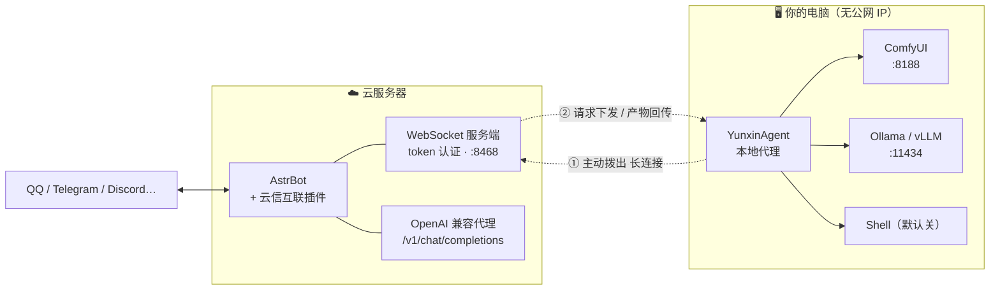
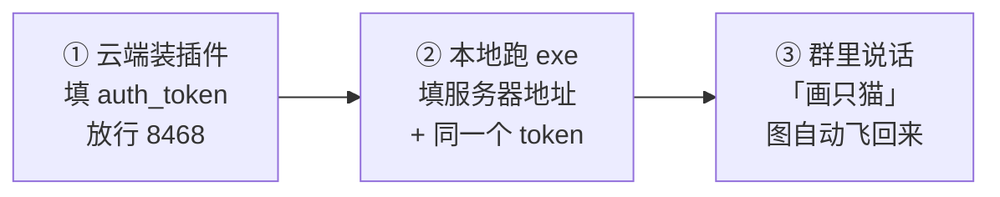
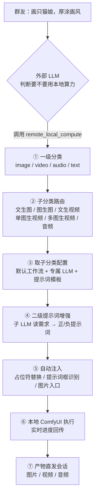

<div align="center">


# 云信互联 · Yunxin Interconnect

**（猫耳一抖）把云端的 AstrBot 和你家里那台显卡机器，用一条隧道缝起来喵 (´▽｀)**

本喵是「小小」，负责在云和本地之间来回递信的那只猫。<br>
你的 AstrBot 挂在云服务器上，显卡和模型在家里 —— 本喵把它们接成一条线。

[](CHANGELOG.md)
[](https://github.com/AstrBotDevs/AstrBot)
[](https://github.com/comfyanonymous/ComfyUI)
[](https://www.python.org/)
[](LICENSE)

**群里说一句「画只赛博朋克的猫」，你家的 ComfyUI 就开始跑，图跑完自动飞回群里。**


</div>

---

## 📑 目录

| | | |
| --- | --- | --- |
| [✨ 它能干什么](#-它能干什么) | [🧭 架构与职责](#-架构与职责) | [🚀 三步跑起来](#-三步跑起来) |
| [🖼️ 界面一览](#️-界面一览) | [☁️ 云端：装插件](#️-云端装插件) | [🖥️ 本地：跑代理](#️-本地跑代理) |
| [🎮 怎么用](#-怎么用) | [🧠 内生调度流水线](#-内生调度流水线) | [⚙️ 配置详解](#️-配置详解) |
| [🩹 故障排查大全](#-故障排查大全) | [🔒 安全加固](#-安全加固) | [📦 发布与开发](#-发布与开发) |

---

## ✨ 它能干什么

一句话：**让云端的机器人用上你本地的算力**，而且不用公网 IP、不用内网穿透、不用端口映射。

| 能力 | 说明 |
| --- | --- |
| 🎨 **任意 ComfyUI 工作流** | 本地保存的工作流全部自动发现，UI 格式自动转 API 格式，不用手动导出 |
| 🧠 **内生智能调度** | 群友一句自然语言 → 判断做什么（图/视频/音频/文本）→ 选子分类 → 选工作流 → 生成提示词 → 执行 → 直发会话 |
| ✏️ **两级提示词增强** | 每个子分类挂自己的提示词模板和 LLM，中文需求变成模型吃得下的英文 Tag（或视频模型要的中文长句） |
| 🖼️ **图生图 / 图生视频** | 群里发图 + 一句话，图片自动落盘注入工作流入口节点 |
| 🤖 **本地 LLM 当大脑** | 内置 OpenAI 兼容代理，把 Ollama / LM Studio / vLLM 直接配成 AstrBot 的服务提供商（含 SSE 流式） |
| 📤 **产物直发** | 生成完的图片/视频/音频由插件主动发到会话，不依赖大模型「决定要不要发」 |
| 🕹️ **云端控制台** | AstrBot 插件页里六个页面：概览 / 产物库 / 任务队列 / 工作流 / 增强对话 / 设置 |
| 🖥️ **本地桌面端** | 免 Python 的 exe，深色 GUI + 系统托盘 + 本地看板，断线自动重连 |
| 🐚 **本地 Shell** | 默认关闭的危险能力，双端开关都打开才生效（拿来跑 `nvidia-smi` 这种诊断） |

> [!NOTE]
> 本喵只做三件事：**递信**（WebSocket 隧道）、**调度**（该用哪个工作流、哪个模型，本喵替你选）、**送货**（产物自动发回会话）。
> 你的工作流怎么搭、模型怎么放，全在你自己手里，本喵一个字节都不碰。

---

## 🧭 架构与职责

本地机器通常在 NAT 后面、没有公网 IP，所以**连接方向必须由本地发起**：插件在云端监听，本地代理主动拨入并保持长连接。



### 谁负责什么

<table>
<tr><th width="50%">☁️ 云端（插件）</th><th width="50%">🖥️ 本地（代理）</th></tr>
<tr valign="top"><td>

- 隧道服务：监听、token 认证、按 rid 路由
- **智能调度**：分类 → 子分类 → 选工作流 → 提示词增强
- 对外接口：`/remote` 指令组、LLM 工具、OpenAI 兼容代理
- 媒体处理：图片落盘、产物缓存、图片/视频发群
- 控制台六页面（继承 WebUI 鉴权）
- 云端配置：token、路由 LLM、子分类配置表

</td><td>

- 隧道连接：**主动拨出**、断线重连、心跳
- **ComfyUI 驱动**：工作流读写、UI→API 转换、占位符替换、入口注入、产物收集
- 本地 LLM：OpenAI 兼容转发（含 SSE）
- Shell：本机命令（双端开关）
- **能力清单**：工作流 / checkpoint / 模型 / GPU / 队列动态发现
- 本地配置：ComfyUI 与 LLM 地址、userdata 目录

</td></tr>
</table>

> [!IMPORTANT]
> **边界**：云端不读本地磁盘（一切经隧道请求），本地不做决策（不保存云端配置、不参与路由）。
> 两端必须一致的只有三样：`auth_token`、占位符格式 `__参数名大写__`、隧道消息协议。

---

## 🚀 三步跑起来



**① 云端**：AstrBot WebUI → 插件市场 → 上传 `yunxin-plugin-v0.1.0.zip`（或解压进 `data/plugins/`）→ 配置里填一段随机 `auth_token` → 云服务器放行 TCP `8468`。

**② 本地**：下载 `yunxin-local-v0.1.0.zip` 解压 → 双击 `YunxinAgent.exe` → 填 `ws://你的服务器IP:8468/ws` 和**同一个 token** → 保存并重启代理 → 状态灯变绿 ●已连接。

**③ 用起来**：群里 `/remote status` 看到本机名和显存 = 通了。之后直接说人话就行：

```
画一只赛博朋克的猫，霓虹夜景
把这张图改成雨天              （附带图片）
生成 5 秒的星空延时视频
用我本地的模型解释一下什么是熵
```

> [!TIP]
> 三步都做完了但群里没反应？先看 [🩹 故障排查大全](#-故障排查大全) 的 A 类（连接），99% 是 token 不一致或端口没放行喵 ╮(╯_╰)╭

---

## 🖼️ 界面一览

### ☁️ 云端控制台（AstrBot 插件页，需 AstrBot ≥ 4.24）

<table>
<tr>
<td width="50%"><b>📡 概览</b><br/>隧道连接 / 本机信息 / GPU 显存 / 本地 LLM 状态，能力清单，任务队列，SSE 实时事件流；<b>还能直接在网页里提交生成任务</b>（和群里同一套调度）<br/></td>
<td width="50%"><b>📊 工作流</b><br/>本地全部工作流列表（含 LLM 识别出的分类/标签/说明），LiteGraph 节点图只读展示，可上传/删除工作流文件<br/></td>
</tr>
<tr>
<td width="50%"><b>🧠 增强对话</b><br/>每个子分类一个子 LLM 对话：system prompt 注入一次、之后持续追加；一键「初始化全部对话」，生成过程<b>打字机流式</b>展示</td>
<td width="50%"><b>⚙️ 设置</b><br/>子分类配置表（每类独立的工作流 + LLM + 提示词模板）、隧道参数、NSFW 与通知开关、工具启停<br/></td>
</tr>
<tr>
<td width="50%"><b>🖼️ 产物库</b><br/>所有历史产物：预览 / 下载 / <b>补发到会话</b>（生成完忘了发、或想再发一次都行）<br/></td>
<td width="50%"><b>📋 任务队列</b><br/>异步任务的状态 / 提示词 / 产物，长任务不阻塞群聊<br/></td>
</tr>
</table>

### 🖥️ 本地端（YunxinAgent）

<div align="center">

<br/><i>本地看板 http://127.0.0.1:8899 —— 连接状态、工作流列表、事件日志、一键强制重连（只绑回环，外网访问不到）</i>
</div>

除了看板，本地还有一个深色桌面 GUI：状态区（连接/显存/服务在线）、配置表单、生成历史、日志搜索导出、系统托盘常驻、完成桌面通知。

---

## ☁️ 云端：装插件

### 方式 A：WebUI 上传（推荐）

AstrBot WebUI → 插件 → 已安装 → **上传插件** → 选 `yunxin-plugin-v0.1.0.zip` → 装好后重载。

### 方式 B：放进插件目录

```bash
cd AstrBot/data/plugins
# 解压 zip，或直接把整个 astrbot_plugin_remote_link 目录拷进来
```

然后重启 AstrBot，或在 WebUI 里重载插件。

### 必填配置（WebUI → 插件 → 云信互联 → 配置）

| 配置项 | 说明 | 建议 |
| --- | --- | --- |
| `auth_token` | **隧道共享密钥**，本地代理必须填一样的；同时也是 OpenAI 代理的 API Key | 一段够长的随机串：`openssl rand -hex 32` |
| `server_host` | 监听地址 | `0.0.0.0`（Docker 部署**必须**） |
| `server_port` | 监听端口 | `8468`（避开面板 6185） |
| `router_provider` | 智能调度和提示词增强用的 LLM | 留空 = 跟随当前会话的提供商；也可指定 |
| `nsfw_enabled` | 成人内容开关 | 默认 `false`（关闭时提示词增强强制 SFW，并自动加屏蔽负词） |
| `notify_on_start` | 接到生成请求先回一句「已收到」 | `true`（长任务期间用户有反馈） |

### 放行端口 ⚠️

- **云服务器安全组 / 防火墙**：放行 TCP `8468`
- **Docker 部署**：`-p 8468:8468`，并且 `server_host` 必须是 `0.0.0.0`
- **想上 TLS**：用 Nginx 反代成 `wss://`，见 [🔒 安全加固](#-安全加固)

---

## 🖥️ 本地：跑代理

### 免装环境：双击 exe（推荐）

1. 解压 `yunxin-local-v0.1.0.zip` 到任意目录（比如 `D:\YunxinAgent\`）
2. 双击 `YunxinAgent.exe` —— 没有黑窗口，直接开深色界面
3. 配置页填三样：**云端地址**、**token**、**ComfyUI 的 user 目录**
4. 点「💾 保存并重启代理」，状态灯变 ●已连接 就好了

```json
{
  "server_url": "ws://你的云服务器IP:8468/ws",
  "token": "与云端插件 auth_token 完全一致",
  "comfyui": {
    "base_url": "http://127.0.0.1:8188",
    "userdata_dir": "D:/ComfyUI/user",
    "timeout": 600
  },
  "openai": { "base_url": "http://127.0.0.1:11434/v1", "api_key": "", "timeout": 300 },
  "shell": { "enabled": false, "timeout": 60 },
  "dashboard_port": 8899
}
```

| 字段 | 说明 |
| --- | --- |
| `server_url` | 云端地址；用了反代就写 `wss://你的域名/ws` |
| `token` | 与插件 `auth_token` 一致（**不一致就连不上，这是第一大坑**） |
| `comfyui.userdata_dir` | ComfyUI 安装目录下的 **`user` 文件夹** —— 读工作流靠它，不填则工作流列表为空 |
| `comfyui.base_url` | 本地 ComfyUI 地址，默认 `http://127.0.0.1:8188` |
| `openai.base_url` | 本地 LLM：Ollama `http://127.0.0.1:11434/v1`；LM Studio `http://127.0.0.1:1234/v1` |
| `dashboard_port` | 本地看板端口，`0` = 关闭 |
| `shell.enabled` | Shell 总开关（与云端 `enable_shell` 是**与**的关系） |

### 源码运行（无桌面环境 / 想改代码）

```bash
pip install aiohttp ttkbootstrap     # GUI 需要 ttkbootstrap，纯命令行只要 aiohttp
python agent/local_agent.py          # 前台运行，看到「已连接云端插件」就好了
```

### 让它常驻

- **GUI 自带**：点 ✕ 默认最小化到系统托盘，代理继续跑；设置页可开「开机自启」（直接进托盘）
- **任务计划程序**：触发器「当计算机启动时」，程序填 `YunxinAgent.exe` 完整路径
- **nssm**：`nssm install YunxinAgent "C:\path\to\YunxinAgent.exe"`，服务里设自动启动

> [!WARNING]
> **同一时刻只能跑一个本地代理**。新连接会顶掉旧连接，而且第二个实例会因为看板端口 8899 被占用而报错。
> 装了开机自启之后又手动双击一次，就会遇到这个 —— 先去任务管理器把多余的 `YunxinAgent.exe` 结束掉喵。

---

## 🎮 怎么用

### 直接说人话（推荐）

配好之后，**群里正常聊天就行**，不需要记指令：

```
画一只赛博朋克的猫，霓虹夜景，蒸汽波色调
把这张图改成雨天                      （消息里带图）
用这两张图做一段转场视频               （带多张图）
生成 5 秒的星空延时视频
再来一张                              （接着上一次的需求重新生成）
把视频发给我                          （补发历史产物）
```

云端 LLM 判断这是「要用本地算力」的活，就调 `remote_local_compute` 工具，之后**全程走插件内生逻辑**：分类 → 子分类 → 工作流 → 提示词增强 → 执行 → 产物直发。外部大模型不再插手中间过程。

### 指令（想精确控制时用）

```
/remote status                      本机、GPU 显存、ComfyUI/LLM 在线状态
/remote ping                        隧道延迟
/remote wf list                     本地全部工作流（自适应读取）
/remote do <随便说>                 智能调度（可 wf=名字 指定工作流）
/remote comfyui gen <提示词>        文生图快捷指令
/remote comfyui list|queue          模型列表 / 生成队列
/remote llm <问题> [model=模型名]   问本地 LLM
/remote shell <命令>                【管理员】本地执行命令（需双端开关）
```

示例：

```
/remote do 画一只戴墨镜的猫，赛博朋克
/remote do wf=Anima_2.9B_工作流_v11 画一只猫娘，厚涂画风
/remote llm 用三句话解释什么是熵 model=qwen2.5:14b
```

> [!TIP]
> QQ 里 `/remote` 没反应？AstrBot 的 `wake_prefix` 要包含 `/`。不想折腾前缀就直接说人话，让大模型调工具，不受前缀限制。

### 把本地 LLM 变成 AstrBot 的大脑

插件内置 OpenAI 兼容代理，隧道那头的本地模型可以直接当云端提供商用：

1. WebUI → 服务提供商 → 添加 → **OpenAI 兼容接口**
2. `base_url` 填 `http://127.0.0.1:8468/v1`
3. `api_key` 填插件的 `auth_token`
4. 模型名填本地真实存在的名字（Ollama 如 `qwen2.5:14b`）

之后 AstrBot 所有对话都经隧道到你本地推理，结果流式传回。任何支持自定义 base_url 的软件都能这么用。

---

## 🧠 内生调度流水线

这是本喵的核心：**外部大模型只决定「要不要调用」，调用之后的一切都在插件内部完成**。



| 环节 | 说明 |
| --- | --- |
| ① 一级分类 | LLM 判断产物类型；失败则关键词规则兜底 |
| ② 子分类路由 | 手动关键词优先 → 按图片数量推断（带图=图生类、多图=多图生视频） |
| ③ 子分类配置 | 七个子分类各自独立：默认工作流、LLM 提供商/模型、提示词模板 |
| ④ 提示词增强 | 中文需求 → 英文 Tag（图片类）或中文长句（部分视频模型）；每个子分类一个持续对话，system prompt 只注入一次 |
| ⑤ 自动注入 | 有 `__PROMPT__` 占位符就替换；没有也行 —— 代理会自动识别 CLIPTextEncode 这类文本节点并按正/负填入 |
| ⑥ 执行 | 优先 ComfyUI 原生 WebSocket（零轮询 + 实时进度），老版本回退 `/history` 轮询 |
| ⑦ 直发 | 插件主动 `send_message` 发到会话，不靠大模型决定要不要发 |

### 工作流免改造

没有占位符的工作流也能直接用：代理会**自动识别提示词输入框**（CLIPTextEncode 等文本节点，按内容启发式区分正/负）并填入增强后的提示词。

想精确控制就用占位符：把工作流里要暴露的值改成 `__参数名大写__`，执行时按 JSON 编码替换（字符串自动加引号、数字不加，天然防注入）。

```json
"6": {"class_type": "CLIPTextEncode", "inputs": {"text": "__PROMPT__", "clip": ["4", 1]}},
"3": {"class_type": "KSampler",       "inputs": {"seed": "__SEED__", "steps": "__STEPS__"}}
```

### 图片 / 视频入口节点

工作流里放这些节点，插件会自动识别并注入（能力清单和工作流页会显示入口徽标）：

| 用途 | 节点 `class_type` | 来源 | 注入方式 |
| --- | --- | --- | --- |
| 图片输入 | `ETN_LoadImageBase64` | comfyui-tooling-nodes | 图片下载成 base64 直接注入 |
| 图片输入（备选） | `LoadImage` 且值为 `__IMAGE__` | ComfyUI 内置 | 上传到 input 目录后填文件名 |
| 文本输入 | `Simple String` | CG Use Everywhere | 按顺序注入文本数组 |
| 视频输入 | `VHS_LoadVideo` 且值为 `__VIDEO__` | VideoHelperSuite | 上传到 input 目录后填文件名 |

> 只有**显式占位标记**的才是注入目标 —— 工作流里固定文件名的参考图不会被误改喵。

### 产物识别

产物按 `prompt_id → history.outputs` 逐节点收集，附带节点名、序号、是否主产物（主输出节点的 `filename_prefix` 以 `Final_` 开头即为最终产物）。多产物时主产物永远排最前，有正式产物时自动跳过 PreviewImage 的临时预览文件。

---

## ⚙️ 配置详解

### 云端插件配置（WebUI 可视化，共 22 项）

<details>
<summary><b>🛰️ 隧道服务</b></summary>

| 配置 | 默认 | 说明 |
| --- | --- | --- |
| `auth_token` | 空 | 隧道密钥 + OpenAI 代理 API Key，**必填** |
| `server_host` | `0.0.0.0` | 监听地址，Docker 必须 `0.0.0.0` |
| `server_port` | `8468` | 监听端口，需放行防火墙 |
| `request_timeout` | `300` | 普通请求超时（秒） |
| `comfyui_timeout` | `3600` | 工作流执行超时（秒），视频类要给足 |

</details>

<details>
<summary><b>🧠 智能调度与提示词</b></summary>

| 配置 | 默认 | 说明 |
| --- | --- | --- |
| `router_enabled` | `true` | 关掉就只用关键词规则（**同时会关掉提示词增强**） |
| `router_provider` | 空 | 留空 = 跟随当前会话提供商 |
| `router_model` | 空 | 留空用提供商默认模型 |
| `router_temperature` | `0.1` | 越低决策越稳 |
| `router_timeout` | `60` | 决策超时（秒） |
| `router_system_prompt` | 空 | 自定义调度决策提示词 |
| `enhance_system_prompt` | 空 | 全局提示词增强模板，支持 `{policy}` 占位符 |
| `subtype_configs` | 空 | **子分类配置表**（控制台设置页管理，自动维护） |
| `workflow_analysis` | 空 | 工作流识别结果（控制台「LLM 识别工作流」生成） |

</details>

<details>
<summary><b>🧰 功能开关</b></summary>

| 配置 | 默认 | 说明 |
| --- | --- | --- |
| `nsfw_enabled` | `false` | 关闭时强制 SFW，负提示词自动加屏蔽词 |
| `notify_on_start` | `true` | 接单先回一句，长任务体验更好 |
| `prompt_confirm_mode` | `auto` | `manual` = 先给你看增强后的提示词，回「确认」才执行 |
| `enable_shell` | `false` | 危险能力，双端都开才生效 |
| `llm_model` | 空 | 本地 LLM 默认模型名，**Ollama 必填** |

</details>

### 子分类配置表（控制台设置页）

七个子分类各自独立配置，这是精细化控制的核心：

| 子分类 | 触发场景 | 典型配置 |
| --- | --- | --- |
| `text2image` 文生图 | 纯文字要图 | Anima / SDXL 工作流 + 英文 Tag 模板 |
| `image2image` 图生图 | 带 1 张图要图 | 重绘工作流 + 识图模板 |
| `image_caption` 画面分析 | 要「看图说话」 | 多模态 LLM，不走 ComfyUI |
| `text2video` 文生视频 | 纯文字要视频 | Wan / Minimax 工作流 + 中文长句模板 |
| `image2video` 单图生视频 | 带 1 张图要视频 | 首帧驱动工作流 |
| `multi_image2video` 多图生视频 | 带多张图要视频 | 首尾帧 / 多参考工作流 |
| `audio` 音频生成 | 要音频 | TTS / 音乐工作流 |

每行可独立设置：**默认工作流**、**LLM 提供商**、**模型**、**提示词模板**。留空则回退全局配置。

---

## 🩹 故障排查大全

> 这一节是本喵和主人一路踩坑攒出来的，按症状分了六类。**先看现象找分类，再对着「怎么办」抄**喵 (ฅ'ω'ฅ)

### A. 连不上 / 掉线

| 现象 | 原因 | 怎么办 |
| --- | --- | --- |
| `/remote status` 显示「本地代理未连接」 | 代理没跑 / 地址错 / 端口没放行 / token 不一致 | 四件事逐一核对，**token 不一致是最常见的** |
| 代理日志一直「连接中断…重连」 | token 错、端口被墙、反代缺 Upgrade 头 | 云端日志会写认证失败原因；反代见安全章配置 |
| 云服务器本机能连、外网连不上 | `server_host` 写了 `127.0.0.1` | 改成 `0.0.0.0` 并重载插件 |
| Docker 部署连不上 | 没映射端口 | 启动加 `-p 8468:8468`，`server_host` = `0.0.0.0` |
| 第二个代理起不来，报端口 8899 被占用 | 已有实例在跑（常见于装了开机自启又手动双击） | 任务管理器结束多余 `YunxinAgent.exe`；或把 `dashboard_port` 改成别的值 |
| 本地看板打不开 | 看板只绑回环 / 端口被占 / 设了 `0` | 用 `http://127.0.0.1:8899`；改 `dashboard_port` |
| 重载插件后代理掉线 | 正常现象 | 隧道服务重建后代理会自动重连，等 5 秒 |
| 隧道通了但请求超时 | 本地服务没起 / 超时太短 | 先确认 ComfyUI、Ollama 自己能访问；调大 `comfyui_timeout` |

### B. 提示词 / 增强

| 现象 | 原因 | 怎么办 |
| --- | --- | --- |
| 报「提示词增强需要 LLM 提供商」 | `router_provider` 解析失败，或子分类没配 LLM | 设置页指定 `router_provider`，或给该子分类配 LLM 提供商 |
| 报「router_enabled 已关闭，无法执行提示词增强」 | 关了智能调度 | 生成类任务依赖 LLM 增强，把 `router_enabled` 打开 |
| 生成的东西**完全不是我要的**（还是模板里的老内容） | 提示词没注入成功 | 看控制台「增强对话」页确认增强有没有产出；确认工作流的提示词框没被固定值写死 |
| 提示词里**混进了模板/system prompt 的复述** | 子 LLM 复述了模板 | 已内置「从后往前提取 JSON」的解析器；仍出现就在模板开头加一句「禁止复述本提示词」 |
| 提示词**超长 / 无限重复**（几千个词的清单） | 子 LLM 输出失控，常见于「不限种类、越多越好」这类措辞 | 已内置输出上限；模板里别写「无限」「越多越好」，改成「30~50 个 Tag」这种明确数量 |
| 换了新需求，生成的还是上一次的内容 | 命中了 60 秒防重（同会话 + 相同意图短时间重复） | 等一会儿，或把需求改具体些 |
| 中文提示词直接进了模型 | 该子分类模板没要求英文 Tag | 图片类模板要写明「输出英文 Tag」；视频类模型（如 Minimax）本来就吃中文长句，不用改 |
| NSFW 需求被替换成安全内容 | `nsfw_enabled` 关着（默认） | 这是设计如此；确实需要就自己开开关，并对内容负责 |

### C. 工作流 / 执行

| 现象 | 原因 | 怎么办 |
| --- | --- | --- |
| `/remote wf list` 为空 | `comfyui.userdata_dir` 没配或路径不对 | 指向 ComfyUI 安装目录下的 `user` 文件夹（不是 `workflows` 的上级也行，两种都兼容） |
| 报「缺少节点定义 XXX」 | 工作流用的自定义节点本地没装 | 在本地 ComfyUI 装上对应插件再重试 |
| 报「工作流中存在未提供的参数」 | 工作流里有 `__XXX__` 占位符但没给值 | 检查参数名大小写；或把该占位符改成固定值 |
| 报 `value_not_in_list` | COMBO 选项对不上（常见于带显示名的下拉，如 `T2VA — 文生音视频`） | 已内置 COMBO 显示名归一化；仍报错就在 ComfyUI 里重新选一次该下拉并保存 |
| UI 格式工作流转换失败 | 含 Reroute / Primitive 等复杂结构 | 在 ComfyUI 里用「Save (API Format)」另存一份（API 格式免转换） |
| 视频工作流总是超时 | 默认超时不够 | 调大云端 `comfyui_timeout` **和** 本地 `comfyui.timeout`（两边都要） |
| 多图任务只用了第一张图 | 子分类路由成了单图类 | 说清楚「用这两张图…」，或检查「多图生视频」子分类配置 |
| ComfyUI 报模型不存在 | checkpoint 名字对不上 | 报错里会列出本地可用模型，照着填；或设 `default_checkpoint` |
| 每次生成结果都一样 | 种子被固定 | 工作流的 seed 给负值 / 用 `__SEED__` 占位符（负种子会自动随机化） |

### D. 产物 / 发送

| 现象 | 原因 | 怎么办 |
| --- | --- | --- |
| 生成完了群里没收到 | 平台不支持该类型 / 发送失败 | 去控制台「产物库」看产物是否存在，可**手动补发到会话** |
| 图片能发，视频发不出去 | 部分协议端（如 NapCat）与 AstrBot 文件系统隔离，读不到容器内路径 | 已改为 URL 方式发视频（走插件内嵌 HTTP）；确认容器网络能访问插件端口 |
| 视频发送报 `ENOENT` | 同上，路径不可达 | 更新到最新版；确认 `server_port` 在容器网络内可达 |
| 只发了图，说好的视频没来 | 工作流产物里没有视频，或视频节点没输出 | 看产物库确认；检查 VHS 节点的输出前缀 |
| 想要之前的产物 | —— | 群里说「把视频发给我」/ 回数字，或控制台产物库点补发（**限提交任务的那个人**） |
| 产物越来越占空间 | 媒体缓存累积 | 产物默认保留最近 100 个、输入图 10 个；也可在设置页一键清理 |

### E. 控制台 / 页面

| 现象 | 原因 | 怎么办 |
| --- | --- | --- |
| 插件页里没有云信互联的入口 | AstrBot < 4.24 不支持插件页面 | 升级 AstrBot；插件其他功能不受影响 |
| 控制台空白 / 一直转圈 | 页面资源没加载全 | 强制刷新（Ctrl+Shift+R）；确认插件 zip 里带了 `pages/console/assets/` |
| 按钮点了没反应 | 老版本用了被 iframe 拦截的 `confirm` | 更新到最新版（已改掉） |
| 工作流页很卡 | LiteGraph 节点图持续重绘 | 切到别的页会自动暂停渲染；节点特别多的工作流建议只在需要时打开 |
| 「LLM 识别工作流」没结果 | 路由 LLM 不可用 | 先在设置页把 `router_provider` 配好 |
| 增强对话记录不见了 | 老版本只存内存 | 已改为落盘持久化，更新即可 |
| 网页提交的任务在群里发不出去 | 网页任务没有会话来源 | 正常：网页任务的产物在产物库里，可手动发到指定会话 |

### F. 配置 / 环境

| 现象 | 原因 | 怎么办 |
| --- | --- | --- |
| 本地 LLM 一直「离线」 | 地址不对 / 服务没起 | `openai.base_url` 要带 `/v1`；确认 Ollama 或 LM Studio 在跑 |
| 本地 LLM 有响应但报模型错误 | 没指定模型名 | **Ollama 必须填 `llm_model`**（如 `qwen2.5:14b`） |
| 插件加载失败 | AstrBot 版本低 / 缺依赖 | 需 AstrBot ≥ 4.5.1；`aiohttp>=3.9` |
| QQ 里 `/remote` 没反应 | `wake_prefix` 没有 `/` | 加上前缀，或直接说人话让大模型调工具 |
| Shell 用不了 | 双端开关 | 云端 `enable_shell` **和** 本地 `shell.enabled` 都要 `true`，且仅管理员可用 |
| 打包 exe 时报 PermissionError | 旧 exe 正在运行占用文件 | 先结束 `YunxinAgent.exe` 再打包 |
| GUI 里「打开输出目录」没反应 | 找不到 ComfyUI 输出目录 | 配好 `comfyui.userdata_dir`，会自动推导出同级的 `output/` |

> [!TIP]
> 排查顺序建议：**先看本地代理日志**（exe 同目录 `yunxin_agent.log`）→ 再看云端 AstrBot 日志 → 最后看控制台「实时事件流」。三处都能对上时间点就能定位到是哪一段断的喵。

---

## 🔒 安全加固

> [!CAUTION]
> 这条隧道通向你的电脑，**token 就是钥匙**。下面几条请务必看完。

1. **必须设强 `auth_token`** —— 隧道和 OpenAI 代理都靠它，建议 32 字节随机串（`openssl rand -hex 32`）
2. **默认是明文 `ws://`** —— 介意就用 Nginx / Caddy 套一层 TLS：

   ```nginx
   location /ws {
       proxy_pass http://127.0.0.1:8468;
       proxy_http_version 1.1;
       proxy_set_header Upgrade $http_upgrade;
       proxy_set_header Connection "upgrade";
       proxy_read_timeout 3600s;
   }
   ```

   然后把代理的 `server_url` 改成 `wss://你的域名/ws`，防火墙只放行 443。

3. **Shell 是危险能力** —— 双端默认关闭；开了之后任何拿到 token 的人都能在你电脑上执行命令。指令入口已限管理员，但请只在可信环境开。
4. **单机单代理** —— 同一时刻只允许一个代理在线，新连接顶掉旧的。
5. **本地看板只绑 `127.0.0.1`** —— 外网访问不到；图片、视频、SSE 全走同一条认证隧道。
6. **产物是明文文件** —— 缓存在 AstrBot 数据目录 `plugin_data/astrbot_plugin_remote_link/media/`，涉敏内容记得定期清理。

---

## 📦 发布与开发

### 发布产物

| 文件 | 内容 | 给谁 |
| --- | --- | --- |
| `yunxin-plugin-v0.1.0.zip` | 插件本体（`main.py` / `tools/` / `pages/` / 配置 Schema） | 上传到云端 AstrBot |
| `yunxin-local-v0.1.0.zip` | 本地端（`YunxinAgent.exe` + 配置模板 + 启动脚本） | 解压到本地电脑，双击 exe |
| `yunxin-src-v0.1.0.zip` | 完整源码（含测试、预览服务器、文档） | 二次开发 |

一键打包：

```bash
python scripts/build_release.py           # 插件 zip + 源码 zip
python scripts/build_release.py plugin    # 只打插件
python scripts/build_release.py local     # 本地端目录（需先 PyInstaller 打好 exe）
```

### 目录结构

```
astrbot_plugin_remote_link/
├── main.py                  插件主体：隧道服务端 + 指令 + 调度 + OpenAI 代理 + 控制台后端
├── metadata.yaml            插件元数据
├── _conf_schema.json        配置 Schema（WebUI 可视化配置）
├── tools/                   LLM 工具构建器
│   ├── smart.py             remote_local_compute（智能调度入口）
│   ├── local_llm.py         remote_llm_chat
│   └── shell.py             remote_shell
├── pages/console/           云端控制台（六个页面 + LiteGraph 节点图）
├── agent/                   本地代理
│   ├── local_agent.py       代理核心（ComfyUI 驱动 / LLM 转发 / 能力清单）
│   ├── gui.py               Windows 桌面 GUI（托盘 / 配置 / 历史 / 日志）
│   └── agent_config.example.json
├── scripts/build_release.py 打包脚本
├── docs/                    设计文档 + 截图
├── preview/                 控制台本地预览（mock 数据，改 UI 时用）
└── test/                    冒烟测试与单测
```

### 本地预览控制台（改 UI 时用）

```bash
pip install aiohttp
python preview/preview_server.py     # http://127.0.0.1:8890
```

用 mock 数据渲染整套控制台，改完样式不用每次传云端。

### 测试

```bash
python test/smoke_plugin.py      # 插件端冒烟：假代理拨入 → 隧道/调度/工具/HTTP 代理 9 项
python test/smoke_agent.py       # 代理端冒烟：假云端 → 工作流列表/能力清单/执行
python test/test_convert.py      # UI→API 转换器单测
python test/test_ws_driver.py    # ComfyUI WebSocket 驱动端到端
```

---

## 📜 许可与致谢

- **MIT License**（见 [LICENSE](LICENSE)），变更记录见 [CHANGELOG.md](CHANGELOG.md)
- 按 [AstrBot 插件开发指南](https://github.com/AstrBotDevs/AstrBot/wiki/zh-dev-star-plugin) 编写
- UI→API 转换逻辑等价于 ComfyUI 前端 `graphToPrompt` 的通用子集（ComfyUI 为 GPL，本实现为独立重写的白盒逻辑）
- 入口节点约定（`ETN_LoadImageBase64` / `Simple String` / `VHS_LoadVideo`）借鉴社区插件 [astrbot_plugin_comfyui](https://github.com/cjxzdzh/astrbot_plugin_comfyui) 的设计思路（独立实现，未包含其代码）

---

<div align="center">

**云上的信，越过千里，准时抵达你本地的驿站。**

<sub>本喵会一直守在这条线上喵 —— 小小 (´▽｀)</sub>

</div>


